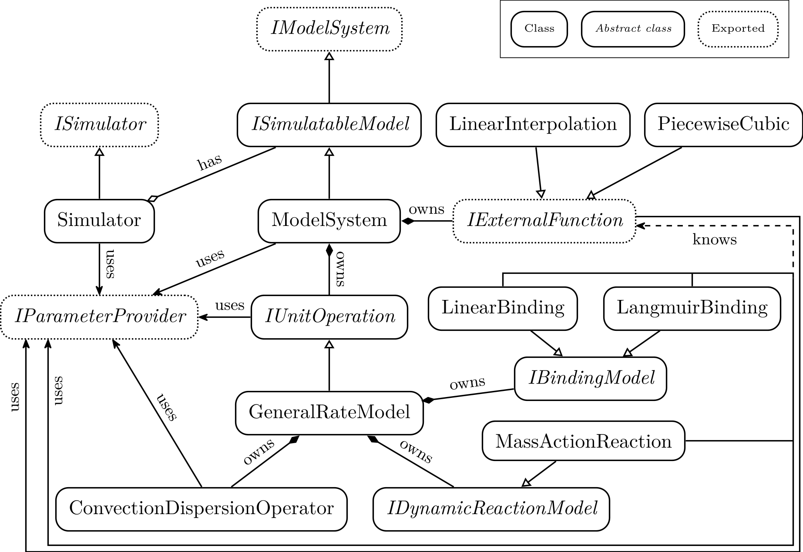

.. _cadet_core_architecture:

Software Architecture
=====================

This section gives a general overview of the object-oriented c++ implementation of CADET-Core and is based on the Software Architecture chapter 3.2 in Samuel Lewekes PhD thesis :cite:`leweke_unified_2021`.

The CADET-Core software is designed to be modular, extendable, maintainable and computationally efficient and robust.
To promote these goals, CADET-Core is implemented in C++, a highly performant, object-oriented language that supports cross-platform compatibility.

Features and Capabilities
^^^^^^^^^^^^^^^^^^^^^^^^^

CADET-Core

- Builds on Windows, Linux and MacOs

- Allows to easily add new frontends as the core simulator is implemented in the library ``libcadet``, which can be called from different frontends.
  Currently, CADET-Core features the command line interface ``cadet-cli`` and CADET-Python, which includes a ``Cadet`` class that serves as a generic HDF5 frontend and calls the ``cadet-cli``.
  The CADET-Process frontend is a separate software that wraps CADET-Python and supports additional pre- and post-processing functionality, as described in the `CADET-Process documentation <https://cadet-process.readthedocs.io/en/latest/index.html>`_.
  The Matlab frontend was deprecated in `commit 4b34e0d5 <https://github.com/cadet/CADET-Core/commits/4b34e0d5fcabee2ff84ff422acac75a6982d6df7/>`_ due to its maintenance overhead.

- Can compute parameter sensitivities via a custom Algorithmic Differentiation (AD) implementation. The AD infrastructure allows for easy extension of new models to support parameter sensitivities, as described in the AD section of the :ref:`model_expansion` chapter.

- Allows arbitrary systems of unit operations, including cycles.

- Implements a method of lines approach to solve the model equations: Custom implementations of model equations and, if required, spatial discretizations, are complemented by the well-established and publicly available time integration software library `SUNDIALS <https://sundials.readthedocs.io/en/latest/index.html>`_.
  Their IDAS solver implements a variable order (up to fifth order) BDF with adaptive time stepping and has proven to be stable and robust.
  Additionally, IDAS supports the forward computation of parameter sensitivities, i.e. solves the forward sensitivity equation system as `described in their documentation <https://sundials.readthedocs.io/en/latest/idas/Mathematics_link.html#forward-sensitivity-analysis>`_.

Implementation Details
^^^^^^^^^^^^^^^^^^^^^^

Classes and realationships

.. _LibcadetClasses:

   Selected relationships of classes in ``libcadet`` [1]_.

.. [#] Samuel Lewekes PhD thesis, available at: https://publications.rwth-aachen.de/record/840314

In the following, we briefly describe the purpose of some of the items in the figure above:

Classes with capital letter ``I`` as prefix are abstract classes that define the interface for the derived classes.

``ISimulator``
Exported interface to the simulator.

``Simulator``
Implements time integration including parameter sensitivities.

``IModelSystem``
Defines basic functions that users of libcadet can use to modify a system of submodels (e.g., add submodels, access parameters).

``ISimulatableModel``
Defines functions that the time integration process needs to run.
This includes, for example, evaluation of model equations, solution of linearized model equations, and consistent initialization.

``ModelSystem``
Implements the system of submodels.
It also owns external functions that can be used to modify model parameters based on externally given data (e.g., pH profile).

``IExternalFunction``
Defines the functions for evaluating an externally given function.
For example, an external function can be represented by a piecewise cubic polynomial.
It could also interpolate between given data points or delegate the calls to a MATLAB function.
Besides evaluating the function itself, certain derivatives have to be provided.

``IUnitOperation``
Corresponds to a black box submodel which meets the :ref:`UnitOperationAssumption`.
Besides evaluation of model equations, solution of linearized model equations, and consistent initialization, it also handles ports and their volumetric flow rates.

``GeneralRateModel``
Implements the :ref:`general_rate_model_model`.
It serves as an example for an IUnitOperation implementation in the diagram.
Common functionality between submodels is moved into separate classes or functions (e.g., ``ConvectionDispersionOperator``).

``ConvectionDispersionOperator``
Implements the operator :math:`-u \frac{\partial c}{\partial z} + D_\text{ax} \frac{\partial^2 c}{\partial z^2}`, which is used in many transport models.
It also converts the volumetric flow rate to the interstitial velocity :math:`u` using the cross section area of the column and the porosity.

``IBindingModel``
Defines functions for evaluating the binding rates :math:`f_\text{ads,j}\left(c^p_j, c^s_j\right)` (as used in, e.g., the :ref:`general_rate_model_model`), according to some :ref:`binding_models`. This interface fully encapsulates a binding model.
If supported, binding model parameters may have a :ref:`dependence-on-external-function_bind`.

``IDynamicReactionModel``
Defines functions for evaluating the reaction rates :math:`f_\text{react,i}\left( c \right)` (as used in, e.g., the :ref:`general_rate_model_model`), according to some :ref:`reaction_models`.
If supported, reaction model parameters may have a :ref:`dependence-on-external-function_react`.

.. _UnitOperationAssumption:

Unit Operation submodel assumption
-----------------------------------

- Each submodel has :math:`N_{c,n} \in \mathbb{N}` components, :math:`N_{in, n} \in \mathbb{N}` inlet ports and :math:`N_{out, n} \in \mathbb{N}` outlet ports.

- The dynamics of each submodel n are described by a fully implicit equation (e.g., PDE, PDAE, DAE, ODER) of the form

.. math::

    \mathcal{F}_n \left(t, \mathbf{q}_{in,n}, \mathbf{q}_{out,n}, \mathbf{y}_{in,n}, \mathbf{y}_{n}, \frac{\partial \mathbf{y}_{n}}{\partial t} \right),

where:
  - :math:`t \in (0, T_\text{end})` denotes time,
  - :math:`\mathbf{q}_{in,n}, \mathbf{q}_{out,n} \in \mathbb{R}^{N_{in, n}}` are the inlet port and outlet port volumetric flow rates, respectively,
  - :math:`\mathbf{y}_{in,n} \in \mathbb{R}^{N_{in, n} N_c,n}` is the inlet concentration of all ports and components,
  - :math:`\mathbf{y}_{n}` contains the state variables of the submodel, and :math:`\frac{\partial \mathbf{y}_{n}}{\partial t}` contains its time derivatives.

- The outlet concentration :math:`\mathbf{c}_{out,n,j} \ \colon (0, T_\text{end}) \mapsto \mathbb{R}^{N_{c,n}}` of port :math:`j\in\{1,\dots , N_{out,n}\}` of submodel :math:`n` is a linear function of its state vector :math:`\mathbf{y}_n`.
