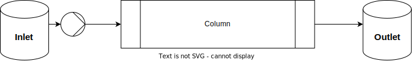

CADET User-Introduction
=======================

In this tutorial, we will build a simple forward simulation with a breakthrough of one component using the following system:

1. Setting Up the Model
-----------------------

We first create a ``ComponentSystem``.
The ``ComponentSystem`` ensures that all parts of the process have the same number of components.
Moreover, components can be named which automatically adds legends to the plot methods.

.. literalinclude:: ../../examples/breakthrough.py
    :lines: 2-5

Inlet Model
^^^^^^^^^^^

In CADET, the ``Inlet`` pseudo unit operation serves as a source for the system and is used to create arbitary concentration profiles as boundary conditions.
The concentration profile is described using a piecewise cubic polynomial (cubic spline in the continuous case) for each component, where the pieces are given by the time sections.
In this example we set a constant inlet concentration of 1 mM.

.. literalinclude:: ../../examples/breakthrough.py
    :lines: 9-13

Column Model
^^^^^^^^^^^^
Adsorption Model
~~~~~~~~~~~~~~~~

Every unit operation model can be equipped with an adsorption model.
The available models are listed in the :ref:`binding model chapter <binding_models>`.

For the :ref:`Langmuir model <multi_component_langmuir_model>`, we use the ``Langmuir`` class.
Then, we decide if we want to use the :ref:`rapid-equilibrium assumption <binding_models>` in the binding model (``binding_model.is_kinetic = False``), which is not the case here (dynamic binding).
Finally, the parameters of the binding model have to be set for each component (they are vectors of length ``n_components``).
All model parameters can be listed using the ``parameters`` attribute.
In case of the Langmuir model, we have to specify the parameters ``adsorption_rate``, ``desorption_rate``, and ``capacity``.

.. literalinclude:: ../../examples/breakthrough.py
    :lines: 18-24

General Rate Model
~~~~~~~~~~~~~~~~~~

We now add a second unit operation, the column model.
For the :ref:`general rate model model <general_rate_model_model>`, we use the ``GeneralRateModel`` class.
In this class, we set the parameters related to transport and column geometry.

.. literalinclude:: ../../examples/breakthrough.py
    :lines: 28-42

Note that film, pore, and surface diffusion are all component-specific, that is, they are vectors of length ``n_components``.

Initial Conditions
~~~~~~~~~~~~~~~~~~

Next, we specify the initial conditions (concentration of the components in the mobile and stationary phases) for the column.
These concentrations are entered as vectors, where each entry gives the concentration for the corresponding component.
In this example, we start with an empty column.

.. literalinclude:: ../../examples/breakthrough.py
    :lines: 45-47

^^^^^^^^^^^^

The ``OUTLET`` is another pseudo unit operation that serves as sink for the system.

.. note:: In this case, the outlet unit is actually not required. We could use the outlet concentration signal of the column model instead.

.. literalinclude:: ../../examples/breakthrough.py
    :lines: 50-52

System Connectivity
^^^^^^^^^^^^^^^^^^^

The connectivity of unit operations is defined in the ``FlowSheet`` class.
This class provides a directed graph structure that allows for the simple definition of configurations for multiple columns or reactor-separator networks, even when they are cyclic.
We add the previously defined units to the flow sheet and add connections between them.

.. literalinclude:: ../../examples/breakthrough.py
    :lines: 55-64

.. note:: Since the flow in the column models is incompressible, the total entering flow rate must equal the total outgoing flow rate.
  This restriction does not apply to a :ref:`CSTR model <cstr_model>`, because it has a variable volume.

Process properties
^^^^^^^^^^^^^^^^^^^
The ``Process`` class is used to define dynamic changes of model parameters or flow sheet connections.
This includes the duration of a simulation (``cycle_time``).
To instantiate a ``Process``, a ``FlowSheet`` needs to be passed as argument, as well as a string to name that process.

.. literalinclude:: ../../examples/breakthrough.py
    :lines: 67-70

3. Setting Up the Simulator and Running the Simulation
------------------------------------------------------

To simulate a ``Process``, a simulator needs to be configured.
The simulator translates the ``Process`` configuration into the API of the corresponding simulator.

.. literalinclude:: ../../examples/breakthrough.py
    :lines: 72-76

4. Plotting the Results
-----------------------

The data is stored in the ``.solution`` group of the ``SimulationResults`` object.
Finally, we plot the concentration signal at the outlet of the column.

.. literalinclude:: ../../examples/breakthrough.py
    :lines: 78

.. image:: _images/breakthrough_chromatogram.png

For further details on the front-end and more examples please refer to the `CADET-Process <https://cadet-process.readthedocs.io/>`_ documentation.
