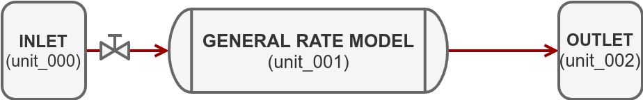
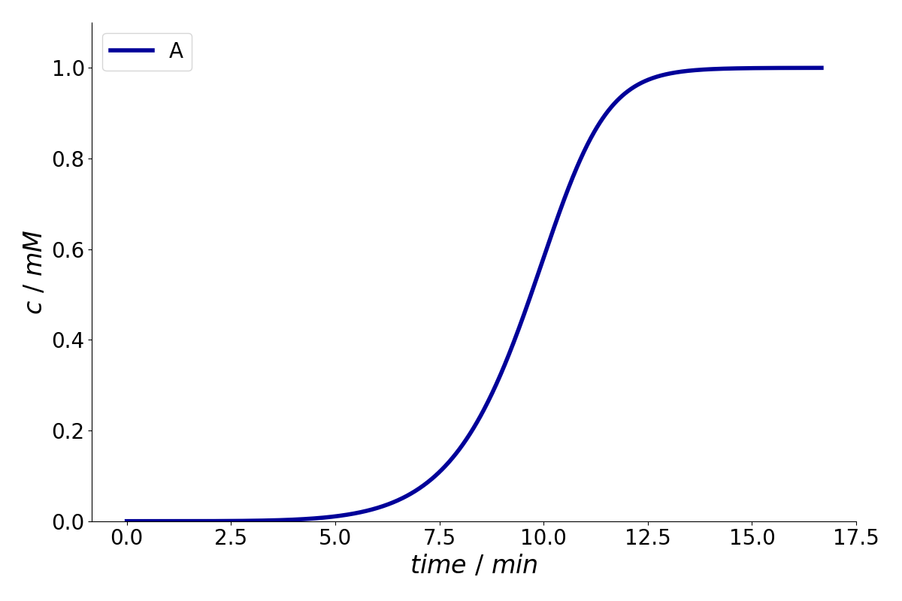

CADET Introduction
==================

Performing a forward simulation comprises several steps: 
  * Setting up the model including all parameters and discretization options
  * Defining sections and switches 
  * Setting up the simulator and actually running the simulation 
  * Evaluating results (e.g., plotting)

In this tutorial, we will build a simple forward simulation with a breakthrough of one component using the following system:

For this purpose, we use :ref:`CADET-Python <cadet_python>`, a file based frontend for CADET.
CADET still must be downloaded (or built from source) as explained in the :ref:`installation guide <installation>`.  
The Python frontend almost exactly maps to the documented :ref:`CADET file format <file_format>` except that all dataset names are lowercase.
This simplifies using the frontend.
The package includes a ``Cadet`` class which serves as a generic HDF5 frontend.

As an example, we consider setting the external porosity for the column model (``unit_001``).
From :ref:`file format <general_rate_model_config>`, the path for this is ``/input/model/unit_001/COL_POROSITY``.
In the Python frontend, this becomes:

.. code-block:: Python3

    sim = Cadet()
    sim.root.input.model.unit_001.col_porosity = 0.33

0. Preliminary Steps
--------------------

First, we need to import some libraries and specify the location of the ``cadet-cli`` executable (core simulator).
It is located in the ``bin`` folder where CADET was installed.

.. literalinclude:: ../../examples/breakthrough.py
    :lines: 2-6

To create the model and specify its parameters, we create an instance of the ``Cadet`` class.
In the ``root`` attribute of this object, the parameter structure is defined as described in the :ref:`file format reference <FFIntroduction>`.
It is implemented as a ``Dict`` of the |addict package|_.
This allows for creating arbitrary nested dictionaries using dot-notation.

.. |addict package| replace:: ``addict`` package
.. _addict package: https://github.com/mewwts/addict

.. warning:: Note, that the ``Cadet`` class does not provide any sanity checks.
  If parameters are misspelled or have the wrong dimensions, they are simply ignored.
  This can cause problems later on, when the simulator is run.

.. literalinclude:: ../../examples/breakthrough.py
    :lines: 9

1. Setting Up the Model
-----------------------

Although the order of the parameter specification does not matter, it is reasonable to first specify the number of unit operations before we select the models and define the parameters.

.. literalinclude:: ../../examples/breakthrough.py
    :lines: 12 

The available models are listed in the :ref:`unit operation chapter <unit_operation_models>`.
The units of the different parameters and quantities are given in the corresponding :ref:`file format <unit_operation_config>` of the respective unit operation.

Inlet Model
^^^^^^^^^^^

In CADET, the ``INLET`` pseudo unit operation serves as a source for the system and is used to create arbitary concentration profiles as boundary conditions.
First, we define an ``INLET`` as the first unit operation by adding the field ``unit_000`` in the ``/input/model/`` group.
The concentration profile is described using a piecewise cubic polynomial (cubic spline in the continuous case) for each component, where the pieces are given by the time sections.
Later, we will define the polynomials, when we look at time sections.

.. literalinclude:: ../../examples/breakthrough.py
    :lines: 15-17

General Rate Model
^^^^^^^^^^^^^^^^^^

We now add a second unit operation, the column model.
For the :ref:`general rate model model <general_rate_model_model>`, we set the ``unit_type`` parameter of the corresponding unit operation model to ``GENERAL_RATE_MODEL``.
In this group, we set the parameters related to transport and column geometry.
For a more detailed description of the parameters and their units, see the :ref:`corresponding file format <general_rate_model_config>`.

.. literalinclude:: ../../examples/breakthrough.py
    :lines: 20-34

Note that film, particle, and surface diffusion are all component-specific, that is, they are vectors of length ``n_components``.

Adsorption Model
~~~~~~~~~~~~~~~~

Every column model can be equipped with an adsorption model.
The available models are listed in the :ref:`binding model chapter <binding_models>`.

For the :ref:`Langmuir model <multi_component_langmuir_model>`, we set the ``adsorption_model`` parameter of the corresponding unit operation model to ``MULTI_COMPONENT_LANGMUIR``.
Then, we decide if we want to use the :ref:`rapid-equilibrium assumption <binding_models>` in the binding model (``is_kinetic = False``), which is not the case here (dynamic binding).
Finally, the parameters of the binding model have to be set for each component (they are vectors of length ``n_components``).
They are described in the :ref:`corresponding file format specification <multi_component_langmuir_config>`.
In case of the Langmuir model, we have to specify the parameters ``kA``, ``kD``, and ``qMAX``.

.. literalinclude:: ../../examples/breakthrough.py
    :lines: 37-41

Initial Conditions
~~~~~~~~~~~~~~~~~~

Next, we specify the initial conditions (concentration of the components in the mobile and stationary phases) for the column.
These concentrations are entered as vectors, where each entry gives the concentration for the corresponding component.
In this example, we start with an empty column.

.. literalinclude:: ../../examples/breakthrough.py
    :lines: 44-45

Setting up the Discretization
~~~~~~~~~~~~~~~~~~~~~~~~~~~~~

There are several options for adapting the spatial discretization of the PDE model.
However, the two most important ones are the number of grid cells in the column (axial direction) and the particles, which are also set in this example.
We choose ``20`` axial cells in the column ``ncol`` and ``5`` radial cells in the particle ``npar``.

.. warning:: These are rather low values to make the examples run faster, since they are only for educational purposes.
  In practice, much higher values are expected (say 100-200 axial cells and 16-32 particle cells).
  Note that the WENO scheme, which handles the advection, drastically reduces the required amount of cells compared to an upwind scheme.

Moreover, we have to specify the number of bound states for each component.
Finally, we set some other options for the discretization, which usually do not need to be changed.  

.. literalinclude:: ../../examples/breakthrough.py
    :lines: 48-66 

Outlet Model
^^^^^^^^^^^^

The ``OUTLET`` is another pseudo unit operation that serves as sink for the system.

.. note:: In this case, the outlet unit is actually not required. We could use the outlet concentration signal of the column model instead.

.. literalinclude:: ../../examples/breakthrough.py
    :lines: 69-70 

2. Setting up Time Sections and Connections
-------------------------------------------

Time Sections
^^^^^^^^^^^^^

:ref:`Time sections <SimTimeSectionsTransitions>` are used to specify changes of parameter values during the simulation.
A section typically corresponds to an operating step (load, wash, elute etc.), but can also be used to indicate changes in connectivity, or even discontinuities of :ref:`model parameters <section_dependent_parameters>`.

In the ``/input/solver/sections/`` group, ``nsec`` denotes the number of sections.
The start and end times of a section are given in the ``section_times`` vector.
It should always start at ``0.0`` and contains ``nsec + 1`` values, that is, the ``i``\ th section goes from ``section_times[i]`` to ``section_times[i+1]``.

The ``section_continuity`` indicates whether a transition from one section to the next is continuous in both the inlet and the parameters.
It has ``nsec - 1`` number of values, since there is one transition less than there are sections.
The continuity is used in CADET’s time integrator, which needs to decide whether to restart on entering a new section.
If the transition is continuous, the time integrator can try to step over the transition without restarting, thus saving some computation time (since the restart is costly).
If you are unsure about the continuity, just leave it at ``0``.

.. literalinclude:: ../../examples/breakthrough.py
    :lines: 73-75  

As mentioned earlier, we now define the ``INLET`` profile using a piecewise cubic polynomial. 
On each section :math:`[ t_i, t_{i+1} ]` a cubic polynomial :math:`p_i` is defined:

.. math::

   p_i( t ) = d * (t - t_i)^3 + c * (t - t_i)^2 + b * (t - t_i) + a,

where the coefficients of the polynomial are ``const_coeff`` (a), ``lin_coeff`` (b), ``quad_coeff`` (c), and ``cube_coeff`` (d).
Note that the constant coefficient ``const_coeff`` determines the starting concentration on each section.
The stopping concentration is given by :math:`p_i( t_{i+1} )` or :math:`p_{i+1}( t_{i+1} )` in case of a continuous profile.

In this example, which has only one section, we define its coefficients by adding the field ``sec_000`` to the inlet unit (``unit_000``).
Since the column should be constantly fed with :math:`1.0 \cdot 10^{-3} mol / m^3`, we set ``const_coeff`` to ``[1.0e-3]`` and all other cofficients to ``[0.0]``.
Note that for more components, a vector of coefficients needs to be specified.

.. literalinclude:: ../../examples/breakthrough.py
    :lines: 78-81 

System Connectivity
^^^^^^^^^^^^^^^^^^^

In order to specify the :ref:`connectivity of the network <networks>`, we have to provide a list of connections.
CADET requires that we append all connections to a long vector (i.e., if each connection is a row in a matrix, CADET wants this matrix in row-major storage).
Moreover, we have to specify the section in which the specified connectivity should be applied.

The elements of a connection are (in order):

   ``[UnitOpID from, UnitOpID to, Component from, Component to, Volumetric flow rate]``

Usually, ``Component from`` and ``Component to`` can be set to ``-1``, which will connect all components from the origin and destination unit operations.

.. note:: Since CADET version 4.1, the flow rates can also be defined with piecewise cubic polynomials.
  Also, for the 2D General rate model inlet ports need to be speciefied.
  For more information on the parameters, see the :ref:`file format specification <FFModelSystemConnections>`.

In this case, we connect all components of ``unit_000`` to ``unit_001``, and from ``unit_001`` to ``unit_002``. 

.. literalinclude:: ../../examples/breakthrough.py
    :lines: 84-88

.. note:: Since the flow in the column models is incompressible, the total entering flow rate must equal the total outgoing flow rate.
  This restriction does not apply to a :ref:`CSTR model <cstr_model>`, because it has a variable volume.

3. Setting Up the Simulator and Running the Simulation
------------------------------------------------------

Before we can start the simulation, we have to specify some settings for the simulator.

First, we set some options for the solver and the time integrator.
Usually, these only need to be adapted in special cases.

.. literalinclude:: ../../examples/breakthrough.py
    :lines: 91-104

Of these options, the most interesting ones are ``time_integrator.abstol`` and ``time_integrator.reltol``, which control the errors during time integration, and ``nthreads``, which sets the number of CPU cores CADET is allowed to use.

Second, we have to specify which results we want CADET to return.
For this, we have to specify the ``/input/return/`` group.
For more information, see the :ref:`file format specification <return>`.

.. note::Because ``return`` is a reserved keyword in Python, we cannot use dot-notation but have to use the ‘proper’ dictionary indexing syntax.

In this example, we want to write the concentration profile of the inlet and outlet of each unit operation.
In addition, we are interested in the concentration in the interstitial volume (bulk volume) of the column.

.. literalinclude:: ../../examples/breakthrough.py
    :lines: 106-115 

Finally, we have to set the time points at which we want to evaluate the solution.
Note that the end time must not exceed the last section time specified in the model.
If the time points are not set explicitly, the time integrator outputs the solution at arbitrary time points between ``0`` and ``section_times[-1]``.

.. literalinclude:: ../../examples/breakthrough.py
    :lines: 117-118 

The last remaining step is to actually run the simulation.
For this, we have to specify a filename, save the configuration to ``H5``-format and call call the ``model``\ ’s ``run()`` function.
We check if the simulation has completed successfully and load the results.

.. literalinclude:: ../../examples/breakthrough.py
    :lines: 121-131 

4. Plotting the Results
-----------------------

The data is stored in the ``/output/`` group of the ``Cadet`` object.
The structure and format of the data is described in the :ref:`file format specification <FFOutput>`.
Finally, we plot the concentration signal at the outlet of the column.

.. literalinclude:: ../../examples/breakthrough.py
    :lines: 134-141

Exercises
---------

- Add a second inlet section from ``10000`` to ``40000`` seconds in which no sample is fed into the column (rectangular pulse).
- Increase the length of the column and the flow rate.
- Increase the desorption coefficient ``MCL_KD``.
- Add a second component.
- Plot the concentration profile of the ``INLET`` unit operation
