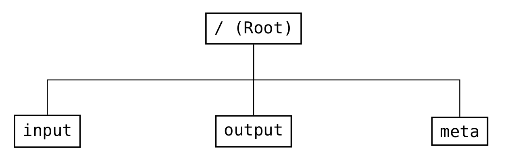
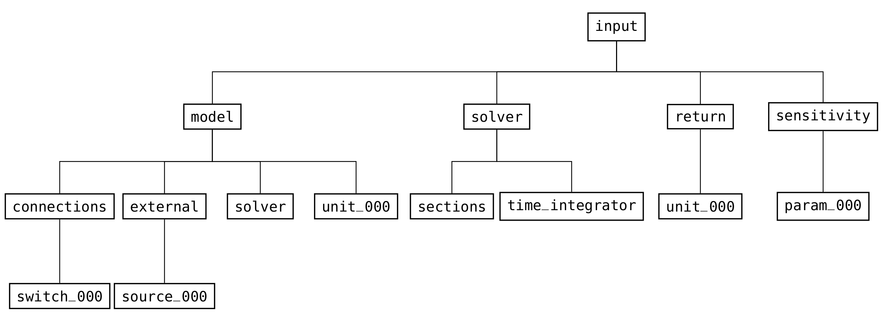
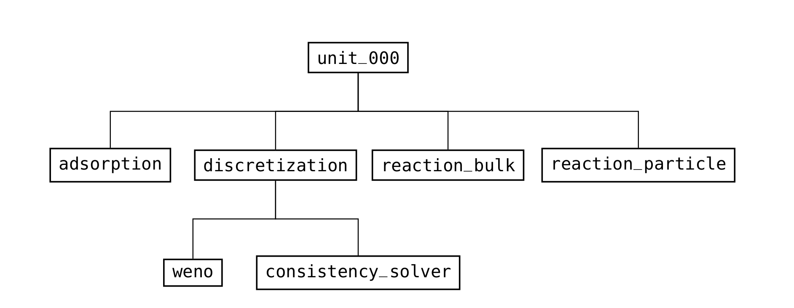
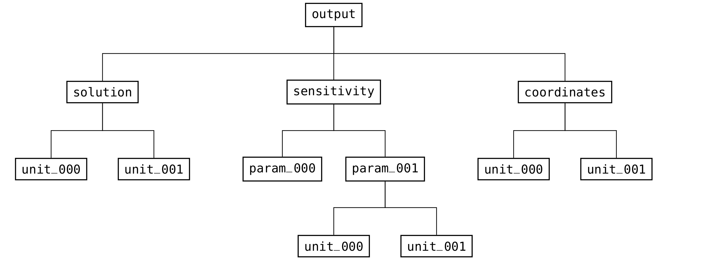

.. _FFIntroduction:

Introduction
============

Global structure
----------------

The global structure (see :numref:`FFRootFig`) is divided into three parts: ``input``, ``output``, and ``meta``.
Every valid CADET file needs an ``input`` group (see :numref:`FFInputFig`) which contains all relevant information for simulating a model.
It does not need an ``output`` (see :numref:`FFOutputFig`) or ``meta`` (see :numref:`FFRootFig`) group, since those are created when results are written.
Whereas the ``output`` group is solely used as output and holds the results of the simulation, the ``meta`` group is used for input and output.
Details such as file format version and simulator version are read from and written to the ``meta`` group.

If not explicitly stated otherwise, all datasets are mandatory.
By convention all group names are lowercase, whereas all dataset names are uppercase.
Note that this is just a description of the file format and not a detailed explanation of the meaning of the parameters.
For the latter, please refer to the corresponding sections in the previous chapter.

.. _FFRootFig:

    Structure of the groups in the root group of the file format

.. _FFInputFig:

    High-level structure of the groups in the input part of the file format

.. _FFModelUnitOpColumnFig:

    Structure of the groups in a column unit operation (/input/model group)

.. _FFOutputFig:

    Structure of the groups in the output part of the file format

Notation and identifiers
------------------------

Reference volumes are denoted by subscripts:

- :math:`m_{IV}^{3}` Interstitial volume
- :math:`m_{MP}^{3}` Bead mobile phase volume
- :math:`m_{SP}^{3}` Bead solid phase volume

Common notation and identifiers that are used in the subsequent description are listed in
:numref:`table_notation_identifiers`.

.. _table_notation_identifiers:
.. list-table:: Common notation and identifiers used in the file format description
   :widths: 30 70
   :header-rows: 1

   * - Identifier
     - Meaning
   * - NCOMP
     - Number of components of a unit operation
   * - NTOTALCOMP
     - Total number of components in the system (sum of all unit operation components)
   * - NPARTYPE
     - Number of particles types of a unit operation
   * - NBND\ :sub:`i` \
     - Number of bound states of component i of the current particle type
   * - NTOTALBND
     - Total number of bound states of the current particle type (sum of all bound states of all components)
   * - NSTATES
     - Maximum of the number of bound states for each component of a particle type
   * - NREACT
     - Number of reactions (in bulk volume or in the current particle type)
   * - NDOF
     - Total number of degrees of freedom of the current unit operation model or system of unit operations
   * - NSEC
     - Number of time integration sections
   * - PARAM_VALUE
     - Value of a generic unspecified parameter

.. _ordering_multi_dimensional_data:

Ordering of multi dimensional data
----------------------------------

Some model parameters, especially in certain binding models, require multi dimensional data.
Since CADET only reads one dimensional arrays, the layout of the data has to be specified (i.e., the way how the data is linearized in memory).
The term “*xyz*-major” means that the index corresponding to *xyz* changes the slowest.

For instance, suppose a model with :math:`2` components and :math:`3` bound states has a “state-major” dataset.
Then, the requested matrix is stored in memory such that all components are listed for each bound state (i.e., the bound state index changes the slowest and the component index the fastest):

::

     comp0bnd0, comp1bnd0, comp0bnd1, comp1bnd1, comp0bnd2, comp1bnd2

This linear array can also be represented as a :math:`3 \times 2` matrix in “row-major” storage format:

::

     comp0bnd0, comp1bnd0
     comp0bnd1, comp1bnd1
     comp0bnd2, comp1bnd2

.. _section_dependent_parameters:

Section dependent model parameters
----------------------------------

Some model parameters (see :numref:`section_dependent_datasets`) can be assigned different values for each section.
For example, the velocity a column is operated with could differ in the load, wash, and elution phases.
Section dependency is recognized by specifying the appropriate number of values for the parameters (see *Length* column in the following tables).
If a parameter depends on both the component and the section, the ordering is section-major.

For instance, the *Length* field of the parameter ``VELOCITY`` reads :math:`1 / NSEC` which means that it is not recognized as section dependent if only :math:`1` value (scalar) is passed. However, if ``NSEC`` many values (vector) are present, it will be treated as section dependent.

Note that all components of component dependent datasets have to be section dependent (e.g., you cannot have a section dependency on component :math:`2` only while the other components are not section dependent).

.. _section_dependent_datasets:
.. list-table:: Section dependent datasets in the 1D unit operation models (``/input/model/unit_XXX group``)
   :widths: 40 30 30
   :header-rows: 1

   * - Dataset
     - Component dependent
     - Section dependent
   * - COL_DISPERSION
     - ✓
     - ✓
   * - FILM_DIFFUSION
     - ✓
     - ✓
   * - PAR_DIFFUSION
     - ✓
     - ✓
   * - PAR_SURDIFFUSION
     - ✓
     - ✓
   * - VELOCITY
     - 
     - ✓

