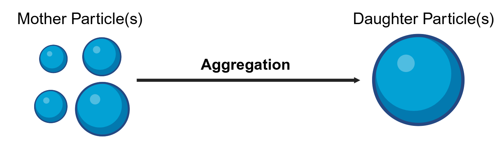

.. _aggregation:

Aggregation Models
~~~~~~~~~~~~~~~~~~

For detailed information on the crystallization models implemented in CADET, including aggregation, please refer to :cite:`Zhang2025`.

The aggregation model can be combined with :ref:`primary_particle_formation` and/or :ref:`fragmentation`.
Further, it can be applied in any of the unit operations, specifically in a STR or DPFR.

The aggregation is governed by the Smoluchowski coagulation equation and describes the evolution of the particle number density :math:`n` changes due to agglomeration/aggregation.
Here, we consider binary particle aggregation based on particle size :math:`x`, which is called internal coordinate.

   Particle agglomeration/aggregation considered in the Smoluchowski coagulation equation. 

The size-based aggregation equation roots in the classical volume based Smoluchowski coagulation equation, which we transform to a size-based equation using the identity

.. math::
    :label: VolumeToSizeIdentity

    \begin{aligned}
        n_v \mathrm{d} (k_v x^3) &= n \mathrm{d} x,
    \end{aligned}

which identifies the change of particle count within a volume interval :math:`[k_vx^3, k_vx^3+d(k_vx^3)]` with the change of particle count within a size interval :math:`[x,x+dx]`.

Size-based binary aggregation is governed by the Smoluchowski coagulation equation

.. math::
    :label: AggregationSizeBased

    \begin{aligned}
        \frac{\partial n(x)}{\partial t} &= 
        \frac{x^2}{2} \int_{x_c}^x \frac{\beta \left((x^3-\lambda^3)^\frac{1}{3},\lambda \right)}{(x^3-\lambda^3)^\frac{2}{3}} n\left( (x^3-\lambda^3)^\frac{1}{3}\right) n(\lambda) \mathrm{d} \lambda
        \\
        &\phantom{=} - n(x) \int_0^{x_\mathrm{end}} \beta(x,\lambda) n(\lambda) \mathrm{d} \lambda .
    \end{aligned}

Here, :math:`[x_{c}, x_{\mathrm{end}}]` is the considered particle size interval, :math:`\beta(x,\lambda)` is the aggregation kernel specific to the underlying aggregation mechanism of your system.

Five kernels are already implemented in CADET. They include:

Constant kernel
    .. math::

        \beta(x, \lambda) = \beta_0

Brownian kernel
    .. math::

        \beta(x, \lambda) = \beta_0 \frac{(x + \lambda)^2}{x \lambda}

Smoluchowski kernel
    .. math::

        \beta(x, \lambda) = \beta_0 (x + \lambda)^3

Golovin kernel
    .. math::
    
        \beta(x, \lambda) = \beta_0 (x^3 + \lambda^3)

Differential force kernel
    .. math::

        \beta(x, \lambda) = \beta_0 (x + \lambda)^2 (x^2 - \lambda^2)
where :math:`\beta_0 > 0` is the aggregation rate constant. Please reach out to us for customized aggregation kernels. 

For information on model parameters and how to specify the model interface, see :ref:`pbm_config`.
