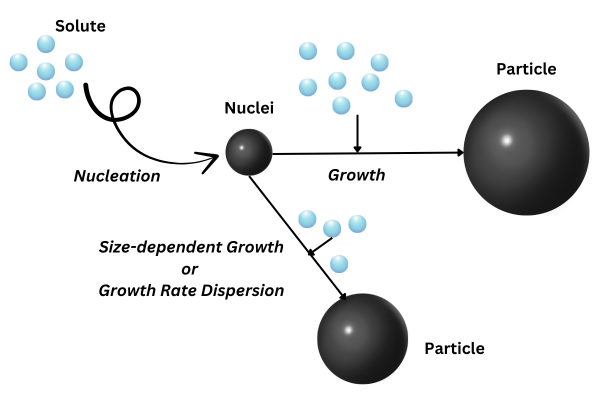

.. _primary_particle_formation:

Primary Particle Formation
~~~~~~~~~~~~~~~~~~~~~~~~~~

In the following, we give a brief overview on the PBM equations for primary particle formation through growth, nucleation, growth rate dispersion.
These equations can be combined with :ref:`aggregation` and/or :ref:`fragmentation`.
For more information on the PBM implemented in CADET, please refer to :cite:`Zhang2024` and :cite:`Zhang2025`.

   Nucleation, growth and growth rate dispersion in PBM. Note that dispersion is used to model (random) variance in growth speed, not the reduction of particle size.

Population Balance Model in a CSTR
^^^^^^^^^^^^^^^^^^^^^^^^^^^^^^^^^^

We assume a well-mixed tank and choose the particle size :math:`x\in (x_c, \infty)` as the internal coodinate, with :math:`x_c>0` being the minimal particle size considered.
The corresponding PBM is given as

.. math::

    \begin{aligned}
        \frac{\partial (n V)}{\partial t} = F_{in}n_{in} - F_{out}n - V \left( \frac{\partial (v_{G}n)}{\partial x} - D_g \frac{\partial^2 n}{\partial x^2} - B_0 \delta (x-x_c) \right),
    \end{aligned}

where :math:`F_{in}, F_{out}\in \mathbb{R}^+` are the volumetric inflow and outflow rates, :math:`V\in\mathbb{R}^+` is the reactor volume,
:math:`n(t, x)\colon [0, T_\text{end}] \times (x_c, \infty) \mapsto \mathbb{R}^+` is the number density distribution,
:math:`n_{in}\in\mathbb{R}^+` is the number density distribution of the inlet feed, :math:`v_{G}\in\mathbb{R}^+` is the particle growth rate,
:math:`D_g\in\mathbb{R}^+` is the growth dispersion rate.

The boundary conditions are given by the regularity boundary condition

.. math::
    :label: RegularityBC

    \begin{aligned}
        \left. \left( nv_{G} - D_g \frac{\partial n}{\partial x} \right) \right|_{x \to \infty}=0,
    \end{aligned}

and the nucleation kinetics boundary condition

.. math::
    :label: NucleationBC

    \begin{aligned}
        \left. \left( nv_{G}-D_g \frac{\partial n}{\partial x} \right)\right|_{x=x_c} = B_0,
    \end{aligned}

where :math:`B_0\in\mathbb{R}^+` is the nucleation kinetics factor representing particle nucleations of size :math:`x_c\in\mathbb{R}^+`.

The model is complemented by the following mass balance equation which accounts for the mass transfer between the particle phase and the solute phase

.. math::

    \begin{aligned}
        \frac{\partial (cV)}{\partial t} = F_{in}c_{in} - F_{out}c -\rho k_v  V \left( B_0x^3_c + 3\int_{x_c}^{\infty} v_{G}n\ x^2 \;\mathrm{d}x \right),
    \end{aligned}

where :math:`c(t)\colon [0, T_\text{end}] \mapsto \mathbb{R}^+` is the solute concentration in the bulk phase, :math:`c_{in}\in\mathbb{R}^+` is the inlet solute mass concentration, :math:`\rho > 0` is the nuclei mass density and :math:`k_v > 0` is the volumetric shape factor of the particles.

Evolution of the reactor's volume is governed by

.. math::

    \begin{aligned}
        \frac{\mathrm{d}V}{\mathrm{d}t} &= F_{\text{in}} - F_{\text{out}}.
    \end{aligned}

Population Balance Model in a DPFR
^^^^^^^^^^^^^^^^^^^^^^^^^^^^^^^^^^

The PBM can also be formulated for a DPFR to model continuous processes.
That is, we choose the axial position within a DPFR as the external coordinate :math:`z\in[0, L]` and formulate the :math:`2D` PBM

.. math::

    \begin{aligned}
        \frac{\partial n}{\partial t} = -v_\text{ax} \frac{\partial n}{\partial z} +D_{ax} \frac{\partial^2 n}{\partial z^2}  - \frac{\partial (v_{G}n)}{\partial x} + D_g \frac{\partial^2 n}{\partial x^2},
    \end{aligned}

where :math:`n(t, x, z)\colon [0, T_\text{end}] \times (x_c, \infty) \times [0, L] \mapsto \mathbb{R}^+` is the number density distribution,
:math:`v_\text{ax}\in\mathbb{R}^+` is the axial velocity and :math:`D_{ax}\in\mathbb{R}^+` is the axial dispersion coefficient.

Boundary conditions for the internal coordinate are again given by Eq. :eq:`RegularityBC` and Eq. :eq:`NucleationBC`.

For the external coordinate :math:`z`, Danckwerts boundary conditions are applied:

.. math::

    \begin{aligned}
        \left. \left( n v_\text{ax}-D_{ax}\frac{\partial n}{\partial z} \right) \right|_{z=0} = v_\text{ax} n_{in,x}, \qquad \left.\frac{\partial n}{\partial z}\right|_{z=L}=0.
    \end{aligned}

The mass balance equation for the solute :math:`c(t, z)\colon [0,T-\text{end}] \times [0,L] \mapsto \mathbb{R}^+` is given by

.. math::

    \begin{aligned}
        \frac{\partial c}{\partial t} = -v_\text{ax} \frac{\partial c}{\partial z} +D_{ax} \frac{\partial^2 c}{\partial z^2} -\rho k_v \left( B_0x^3_c + 3\int_{x_c}^{\infty} v_{G}n x^2 \;\mathrm{d}x \right).
    \end{aligned}

As for the particle phase, the solute mass concentration subjects to the Danckwerts boundary conditions

.. math::

    \begin{aligned}
        \left.\left( c v_\text{ax}-D_{ax}\frac{\partial c}{\partial z} \right) \right|_{z=0} = v_\text{ax} c_{in}, \qquad \left.\frac{\partial c}{\partial z}\right|_{z=L}=0.
    \end{aligned}

Constitutive equations
^^^^^^^^^^^^^^^^^^^^^^

Constitutive equations describe the kinetic processes in the governing equations. The relative supersaturation :math:`s>0` is:

.. math::

    \begin{aligned}
        s=\frac{c-c_{eq}}{c_{eq}},
    \end{aligned}

where :math:`c_{eq}>0` is the solute solubility in the solvent.
The nucleation kinetics can be split into primary and secondary nucleation:

.. math::

    \begin{aligned}
        B_0 = B_p + B_s,
    \end{aligned}

Which are in turn defined by the following constitutive equations.
An empirical equation for primary nucleation is given by:

.. math::

    \begin{aligned}
        B_p=k_ps^u,
    \end{aligned}

where :math:`k_p\in\mathbb{R}^+` is the primary nucleation rate constant and :math:`u\in\mathbb{R}^+` is a constant.
An empirical power-law expression is used for the secondary nucleation:

.. math::

    \begin{aligned}
        B_s=k_bs^bM^k,
    \end{aligned}

where :math:`k_b\in\mathbb{R}^+` is the secondary nucleation rate constant, :math:`b\in\mathbb{R}^+` and :math:`k\in\mathbb{R}^+` (usually set to :math:`1`) are system-related parameters and :math:`M\in\mathbb{R}^+` is the suspension density defined as

.. math::

    \begin{aligned}
        M=k_v\rho\int_{0}^{\infty}n\ x^3\;\mathrm{d}x.
    \end{aligned}

The following expression for the growth rate is implemented:

.. math::

    \begin{aligned}
        v_{G}=k_gs^g(a+\gamma x^p),
    \end{aligned}

where :math:`k_g\in\mathbb{R}^+` is the growth rate constant, :math:`\gamma\in\mathbb{R}^+` quantifies the size dependence, and :math:`g, a, p\in\mathbb{R}^+` are system-related constants.

For information on model parameters and how to specify the model interface, see :ref:`pbm_config`.
