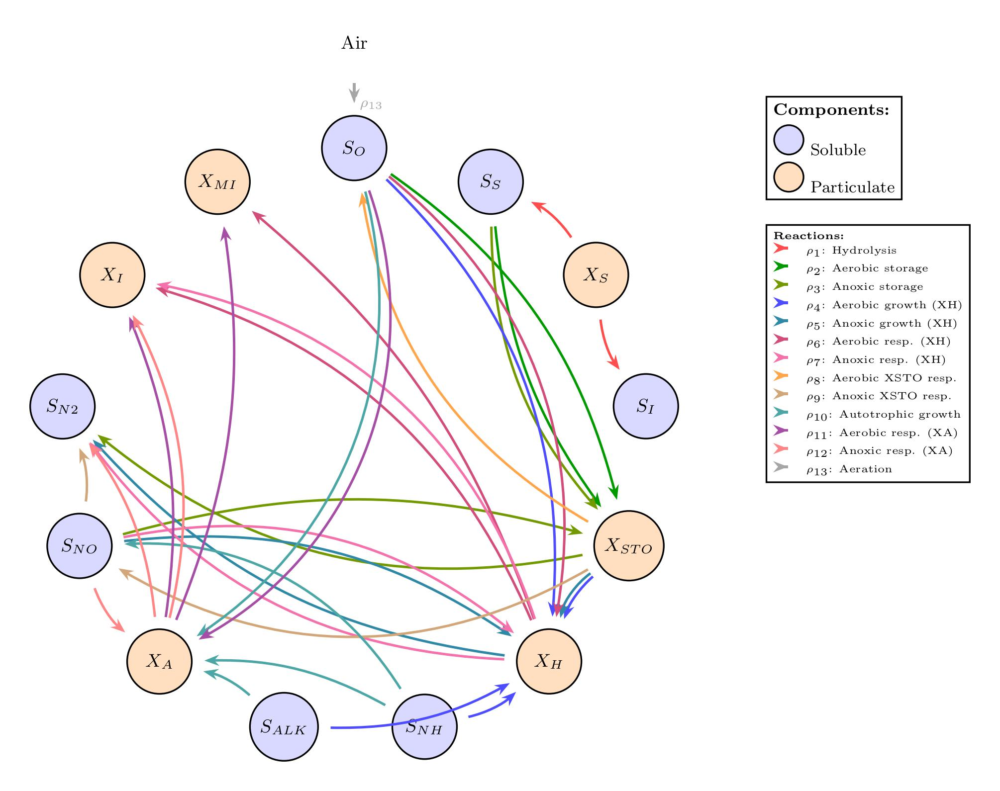

.. _activated_sludge_model:

Activated Sludge Model (ASM3h)
===============================

Activated Sludge Models (ASM) are a group of reaction models published by the International Water Association (IWA)
and mostly used for modelling biological processes in wastewater treatment plants.

It consists of 13 components representing different species in wastewater treatment plants.

The used components with their abbreviations are listed in the following table:

.. list-table::
   :header-rows: 1
   :widths: 20 80

   * - Abbreviation
     - Component
   * - :math:`SO`
     - Dissolved oxygen
   * - :math:`SS`
     - Readily biodegradable substrate
   * - :math:`SNH`
     - Ammonium
   * - :math:`SNO`
     - Nitrite and nitrate
   * - :math:`SN2`
     - Dinitrogen, released by denitrification
   * - :math:`SALK`
     - Alkalinity, bicarbonate
   * - :math:`SI`
     - Soluble inert organic
   * - :math:`XI`
     - Inert Particulate organic
   * - :math:`XS`
     - Slowly biodegradable substrate
   * - :math:`XH`
     - Heterotrophic biomass
   * - :math:`XSTO`
     - Organics stored by heterotrophs
   * - :math:`XA`
     - Autotrophic, nitrifying biomass
   * - :math:`XMI`
     - Mineral particulate matter from biomass

The net flux for each of the components in the ASM is calculated with a stoichiometric
matrix :math:`S \in \mathbb{R}^{13 \times 13}` and a reaction rate vector 
:math:`\varphi_j(c)`, where :math:`j` is the reaction number.
The list of reactions included in the ASM3h model is as follows:

Reaction Rates
~~~~~~~~~~~~~~

.. list-table::
    :header-rows: 1
    :widths: 15 35 50

    * - Reaction Number
      - Reaction Description
      - Rate Equation
    * - :math:`r_1`
      - Hydrolysis of organic structures
      - :math:`k_{h,20} \cdot f_T^{0.04} \cdot \frac{XS/XH}{XS/XH + K_X} \cdot XH`
    * - :math:`r_2`
      - Aerobic storage of SS
      - :math:`k_{STO} \cdot \frac{SO}{SO + K_{h,O2}} \cdot \frac{SS}{SS + K_{h,SS}} \cdot XH`
    * - :math:`r_3`
      - Anoxic storage of SS
      - :math:`k_{STO} \cdot \eta_{h,NO3} \cdot \frac{K_{h,O2}}{SO + K_{h,O2}} \cdot \frac{SNO}{SNO + K_{h,NO3}} \cdot \frac{SS}{SS + K_{h,SS}} \cdot XH`
    * - :math:`r_4`
      - Aerobic growth of XH
      - :math:`\mu_H \cdot \frac{SO}{SO + K_{h,O2}} \cdot \frac{XSTO/XH}{XSTO/XH + K_{h,STO}} \cdot \frac{SNH}{SNH + K_{h,NH4}} \cdot \frac{SALK}{SALK + K_{h,ALK}} \cdot XH`
    * - :math:`r_5`
      - Anoxic growth of XH (denitrification)
      - :math:`\mu_H \cdot \eta_{h,NO3} \cdot \frac{K_{h,O2}}{SO + K_{h,O2}} \cdot \frac{SNO}{SNO + K_{h,NO3}} \cdot \frac{XSTO/XH}{XSTO/XH + K_{h,STO}} \cdot \frac{SNH}{SNH + K_{h,NH4}} \cdot \frac{SALK}{SALK + K_{h,ALK}} \cdot XH`
    * - :math:`r_6`
      - Aerobic endogenous respiration of XH
      - :math:`b_H \cdot \frac{SO}{SO + K_{h,O2}} \cdot XH`
    * - :math:`r_7`
      - Anoxic endogenous respiration of XH
      - :math:`b_H \cdot \eta_{h,end} \cdot \frac{K_{h,O2}}{SO + K_{h,O2}} \cdot \frac{SNO}{SNO + K_{h,NO3}} \cdot XH`
    * - :math:`r_8`
      - Aerobic respiration of internal cell storage products
      - :math:`b_H \cdot \frac{SO}{SO + K_{h,O2}} \cdot \frac{XSTO}{XSTO + K_{h,STO}} \cdot XH`
    * - :math:`r_9`
      - Anoxic respiration of internal cell storage products
      - :math:`b_H \cdot \eta_{h,end} \cdot \frac{K_{h,O2}}{SO + K_{h,O2}} \cdot \frac{SNO}{SNO + K_{h,NO3}} \cdot \frac{XSTO}{XSTO + K_{h,STO}} \cdot XH`
    * - :math:`r_{10}`
      - Aerobic growth of XA
      - :math:`\mu_{AUT} \cdot \frac{SO}{SO + K_{N,O2}} \cdot \frac{SNH}{SNH + K_{N,NH4}} \cdot \frac{SALK}{SALK + K_{N,ALK}} \cdot XA`
    * - :math:`r_{11}`
      - Aerobic endogenous respiration of XA
      - :math:`b_{AUT} \cdot \frac{SO}{SO + K_{N,O2}} \cdot XA`
    * - :math:`r_{12}`
      - Anoxic endogenous respiration of XA
      - :math:`b_{AUT} \cdot \eta_{N,end} \cdot \frac{K_{N,O2}}{SO + K_{N,O2}} \cdot \frac{SNO}{SNO + K_{h,NO3}} \cdot XA`
    * - :math:`r_{13}`
      - Aeration
      - :math:`\frac{iO_2}{1000}`

And the stoichiometric equations are represented in the stoichiometric matrix :math:`S`, which is given by:

.. list-table::
    :header-rows: 1
    :widths: 10 7 7 7 7 7 7 7 7 7 7 7 7 7

    * - Component\\Reaction
      - :math:`r_1`
      - :math:`r_2`
      - :math:`r_3`
      - :math:`r_4`
      - :math:`r_5`
      - :math:`r_6`
      - :math:`r_7`
      - :math:`r_8`
      - :math:`r_9`
      - :math:`r_{10}`
      - :math:`r_{11}`
      - :math:`r_{12}`
      - :math:`r_{13}`
    * - :math:`SO`
      - 0
      - :math:`Y_{STO,aer} - 1`
      - :math:`Y_{STO,anox} - 1`
      - :math:`1 - 1/Y_{H,aer}`
      - :math:`1 - 1/Y_{H,anox}`
      - :math:` f_{XI} - 1`
      - :math:`f_{XI} - 1`
      - -1
      - -1
      - :math:`-(64/14) \cdot 1/Y_A + 1`
      - :math:`f_{XI} - 1`
      - :math:`f_{XI} - 1`
      - 1
    * - :math:`SS`
      - :math:`1 - f_{SI}`
      - -1
      - -1
      - 0
      - 0
      - 0
      - 0
      - 0
      - 0
      - 0
      - 0
      - 0
      - 0
    * - :math:`SNH`
      - :math:`i_{N,XS} - i_{N,SI} \cdot f_{SI} - (1 - f_{SI}) \cdot i_{N,SS}`
      - :math:`i_{N,SS}`
      - :math:`i_{N,SS}`
      - :math:`-i_{N,BM}`
      - :math:`-i_{N,BM}`
      - :math:`i_{N,BM} - f_{XI} \cdot i_{N,XI}`
      - :math:`i_{N,BM} -f_{XI} \cdot i_{N,XI}`
      - 0
      - 0
      - :math:`-1/Y_A - i_{N,BM}`
      - :math:`f_{XI} \cdot i_{N,XI} + i_{N,BM}`
      - :math:`f_{XI} \cdot i_{N,XI} + i_{N,BM}`
      - 0
    * - :math:`SNO`
      - 0
      - 0
      - :math:`(Y_{STO,anox} - 1) / (40/14)`
      - 0
      - :math:`(1 - 1/Y_{H,anox}) / (40/14)`
      - 0
      - :math:`(f_{XI} - 1) / (40/14)`
      - 0
      - :math:`-14/40`
      - :math:`1/Y_A`
      - 0
      - :math:`(f_{XI} - 1) / (40/14)`
      - 0
    * - :math:`SN2`
      - 0
      - 0
      - :math:`(1 - Y_{STO,anox}) / (40/14)`
      - 0
      - :math:`(1/Y_{H,anox} - 1) / (40/14)`
      - 0
      - :math:`(-f_{XI} - 1) / (40/14)`
      - 0
      - :math:`--14/40`
      - 0
      - 0
      - :math:`(1 + f_{XI} ) / (40/14)`
      - 0
    * - :math:`SALK`
      - :math:`(i_{N,XS} - i_{N,SI} \cdot f_{SI} - (1 - f_{SI}) \cdot i_{N,SS})/14`
      - :math:`i_{N,SS} / 14`
      - :math:`i_{N,SS} / 14 - (Y_{STO,anox} - 1) / 40`
      - :math:`-i_{N,BM} / 14`
      - :math:`-i_{N,BM} / 14 - (1 - 1/Y_{H,anox}) / 40`
      - :math:`(-f_{XI} \cdot i_{N,XI} + i_{N,BM}) / 14`
      - :math:`(-f_{XI} \cdot i_{N,XI} + i_{N,BM}) / 14  (-f_{XI} + 1) / 40`
      - 0
      - :math:`1/40`
      - :math:`-(1/Y_A) 1/7- i_{N,BM}/14`
      - :math:`f_{XI} \cdot i_{N,XI} + i_{N,BM} / 14`
      - :math:`(-f_{XI} \cdot i_{N,XI} + i_{N,BM})/14 - (f_{XI} - 1) / 40`
      - 0
    * - :math:`SI`
      - :math:`f_{SI}`
      - 0
      - 0
      - 0
      - 0
      - 0
      - 0
      - 0
      - 0
      - 0
      - 0
      - 0
      - 0
    * - :math:`XI`
      - 0
      - 0
      - 0
      - 0
      - 0
      - :math:`f_{XI}`
      - :math:`f_{XI}`
      - 0
      - 0
      - 0
      - :math:`f_{XI}`
      - :math:`f_{XI}`
      - 0
    * - :math:`XS`
      - -1
      - 0
      - 0
      - 0
      - 0
      - 0
      - 0
      - 0
      - 0
      - 0
      - 0
      - 0
      - 0
    * - :math:`XH`
      - 0
      - 0
      - 0
      - 1
      - 1
      - -1
      - -1
      - 0
      - 0
      - 0
      - 0
      - 0
      - 0
    * - :math:`XSTO`
      - 0
      - :math:`Y_{STO,aer}`
      - :math:`Y_{STO,anox}`
      - :math:`-1/Y_{H,aer}`
      - :math:`-1/Y_{H,anox}`
      - 0
      - 0
      - -1
      - -1
      - 0
      - 0
      - 0
      - 0
    * - :math:`XA`
      - 0
      - 0
      - 0
      - 0
      - 0
      - 0
      - 0
      - 0
      - 0
      - 1
      - -1
      - -1
      - 0
    * - :math:`XMI`
      - 0
      - 0
      - 0
      - 0
      - 0
      - :math:`f_{XMI,BI}`
      - :math:`f_{XMI,BI}`
      - 0
      - 0
      - 0
      - :math:`f_{XMI,BI}`
      - :math:`f_{XMI,BI}`
      - 0

    Network representation of the AMS3h model.

For more information on model parameters required to define in CADET file format, see :ref:`activated_sludge_model_config`.

Combining the ASM3 model within CADET
~~~~~~~~~~~~~~~~~~~~~~~~~~~~~~~~~~~~~
The ASM3h model is a konkrete implementation of of the ASM framework which is aimled to be used as ASM3h in SIMBA.
But with different configuations it is also flexible to to be used in the general CADET framework.

Active Aeration
---------------
In configuation of the ASM3 model, there is the option to set the volume parameter of the aeration reaction.
This volume refers to the volume of the aeration tank.
But we recomend to model the aeration by setting up the Inlet unit Operation and connect it to the unit operation where the ASM3 model is used.
This way the aeration can be handled more flexible, see :ref:`inlet_operation`.
To deactivate the aeration reaction in the ASM3 model, set the volume parameter to zero.

Fractionation
-------------

TODO

References
~~~~~~~~~~
- TODO