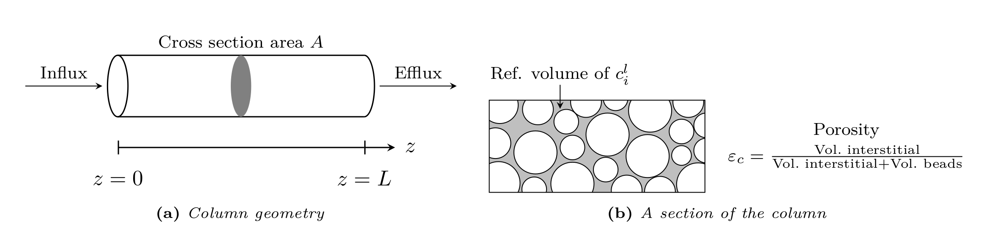

.. _general_rate_model_model:

General rate model (GRM)
~~~~~~~~~~~~~~~~~~~~~~~~

The general rate model is the most comprehensive model of mass transfer in column liquid chromatography, when only the axial coordinate in the column and the radial coordinate in the beads are considered :cite:`Kucera1965,Gu1995,Guiochon2006,Felinger2004`.

The main assumptions are:

- The cross sections of the column are homogenous in terms of interstitial volume, fluid flow, and distribution of components.
  Thus, only one spatial coordinate in axial direction is needed and radial transport is neglected in the column bulk volume.

- The bead radii :math:`r_{p}` are much smaller than the column radius :math:`r_c` and the column length :math:`L`.
  Therefore, the beads can be seen as continuously distributed inside the column (i.e., at each point there is interstitial and bead volume).

.. _table_features:
.. list-table:: Variables and unknowns
   :widths: 20 30 50
   :header-rows: 1

   * - Variable
     - Domain
     - Description
   * - :math:`i`
     - :math:`\left\{ 0, \dots, N_{\text{comp}} - 1 \right\}` 
     - Component index
   * - :math:`j`
     - :math:`\left\{ 0, \dots, N_{\text{partype}} - 1 \right\}`
     - Particle type index  
   * - :math:`m_{j,i}`
     - :math:`\left\{ 0, \dots, N_{\text{bnd},j,i} - 1 \right\}`
     - Bound state index of :math:`i`\ th component in :math:`j`\ th particle type
   * - :math:`m_j`
     - :math:`\left\{ 0, \dots, \sum_{i=0}^{N_{\text{comp}}-1} N_{\text{bnd},j,i} - 1 \right\}`
     - Total bound state index in particle type :math:`j`
   * - :math:`t`
     - :math:`\left[0, T_{\text{end}}\right]`
     - Time coordinate 
   * - :math:`z`
     - :math:`\left[0, L\right]`
     - Axial coordinate
   * - :math:`r`
     - :math:`\left[r_{c,j}, r_{p,j}\right]`
     - Generic bead radial coordinate 
   * - :math:`c^l_{i}(t,z)`
     - :math:`\left[0, T_{\text{end}}\right] \times [0, L]`
     - Interstitial concentration of the :math:`i`\ th component
   * - :math:`c^p_{j,i}(t, z, r)`
     - :math:`\left[0, T_{\text{end}}\right] \times [0, L] \times \left[r_{c,j}, r_{p,j}\right]`
     - Mobile phase concentration of the :math:`i`\ th component in the :math:`j`\th particle type
   * - :math:`c^s_{j,i,m_{j,i}}(t, z, r)`
     - :math:`\left[0, T_{\text{end}}\right] \times [0,L] \times \left[r_{c,j}, r_{p,j}\right]`
     - Solid phase concentration of the :math:`i`\ th component's :math:`m_{j,i}`\th bound state in particles of type :math:`j`
   * - :math:`j_{f,j,i}(t, z)` 
     - :math:`\left[0, T_{\text{end}}\right] \times [0, L]`
     - Flux of the :math:`i`\ th component through stagnant film into the bead of type :math:`j` 

.. _ModelGRMColumn: 

    Column bulk model

The GRM describes transport of solute molecules through the interstitial column volume by convective flow, band broadening caused by axial dispersion, mass transfer resistance through a stagnant film around the beads, pore (and surface) diffusion in the porous beads :cite:`Ma1996,Schneider1968a,Miyabe2007`, and adsorption to the inner bead surfaces.

Consider a column of length :math:`L>0` filled with spherical beads of (possibly) multiple types with radius :math:`r_{p,j} \ll L` (see :numref:`ModelGRMColumn`), where :math:`j` is the particle type index. The mass balance in the interstitial column volume is described by

.. math::
    :label: ModelColumn

    \begin{aligned}
        \frac{\partial c^l_i}{\partial t} = -u \frac{\partial c^l_i}{\partial z} + D_{\text{ax},i} \frac{\partial^2 c^l_i}{\partial z^2} &- \frac{1}{\beta_c} \sum_j d_j \frac{3}{r_{p,j}} k_{f,j,i} \left[ c^l_i - c^p_{j,i}(\cdot, \cdot, r_{p,j}) \right] \\
        &+ f_{\text{react},i}^l\left(c^l\right). 
    \end{aligned}

Here, :math:`c^l_i\colon \left[0, T_{\text{end}}\right] \times [0, L] \rightarrow \mathbb{R}^{\geq 0}` denotes the concentration in the interstitial column volume, :math:`c^p_{j,i}\colon \left[0, T_{\text{end}}\right] \times [0, L] \times [r_{c,j}, r_{p,j}] \rightarrow \mathbb{R}^{\geq 0}` the liquid phase concentration in the beads, :math:`k_{f,j,i}` the film diffusion coefficient, :math:`D_{\text{ax},i}` the dispersion coefficient, :math:`u` the interstitial velocity, :math:`d_j` the volume fraction of particle type :math:`j`, and :math:`\beta_c = \varepsilon_c / (1 - \varepsilon_c)` the column phase ratio, where :math:`\varepsilon_c` is the column porosity (ratio of interstitial volume to total column volume).
If reactions are considered, the term :math:`f_{\text{react},i}^l\left(c^l\right)` represents the net change of concentration :math:`c_i` due to reactions involving component :math:`i`.

Danckwerts boundary conditions :cite:`Danckwerts1953` are applied to inlet and outlet of the column:

.. math::
    :label: BCOutlet

    \begin{aligned}
        u c_{\text{in},i}(t) &= u c^l_i(t,0) - D_{\text{ax},i} \frac{\partial c^l_i}{\partial z}(t, 0) & \forall t > 0,
    \end{aligned}

.. math::
    :label: BCInlet

    \begin{aligned}
        \frac{\partial c^l_i}{\partial z}(t, L) &= 0 & \forall t > 0. 
    \end{aligned}

Note that the outlet boundary condition Eq. :eq:`BCOutlet` is also known as “do nothing” or natural outflow condition.

In the liquid phase of the porous beads (see :numref:`ModelGRMColumn`) the mass balance is given by

.. math::
    :label: ModelBead

    \begin{aligned}
        \frac{\partial c^p_{j,i}}{\partial t} &+ \frac{1 - \varepsilon_{p,j}}{F_{\text{acc},j,i} \varepsilon_{p,j}} \frac{\partial}{\partial t} \sum_{m_{j,i}} c^s_{j,i,m_{j,i}} \\
        &= \underbrace{D_{p,j,i} \left[\frac{\partial^2}{\partial r^2} + \frac{2}{r} \frac{\partial}{\partial r} \right]c^p_{j,i}}_{\text{Pore diffusion}} \\
        &+ \underbrace{\frac{1 - \varepsilon_{p,j}}{F_{\text{acc},j,i} \varepsilon_{p,j}} D_{s,j,i} \left[\frac{\partial^2}{\partial r^2} + \frac{2}{r} \frac{\partial }{\partial r} \right] \sum_{m_{j,i}} c^s_{j,i,m_{j,i}} }_{\text{Surface diffusion}} \\
        &+ f_{\text{react},j,i}^p\left( c_j^p, c_j^s \right) + \frac{1 - \varepsilon_{p,j}}{F_{\text{acc},j,i} \varepsilon_{p,j}} f_{\text{react},j,i}^s\left( c_j^p, c_j^s \right),
    \end{aligned}

where :math:`c^s_{j,i,m_{j,i}}\colon \left[0, T_{\text{end}}\right] \times [0,L] \times [r_{c,j}, r_{p,j}] \rightarrow \mathbb{R}^{\geq 0}` denotes the solid phase concentration of the :math:`i`\ th component’s :math:`m_{j,i}`\ th bound state in the beads of :math:`j`\ th type, :math:`D_{p,j,i}` the effective diffusion coefficient in the beads, :math:`D_{s,j,i}` the surface diffusion coefficient, :math:`F_{\text{acc},j,i} \in [0,1]` the pore accessibility factor, and :math:`\varepsilon_{p,j}` the particle porosity (ratio of pore volume to total bead volume).
The inner bead radius :math:`r_{c,j} \in [0, r_{p,j})` is assumed to be :math:`0` by default, but can be positive in order to account for core-shell particles that have an impermeable core.
Reaction terms in liquid and solid phase are collected in :math:`f_{\text{react},j,i}^p( c_j^p, c_j^s)` and :math:`f_{\text{react},j,i}^s(c_j^p, c_j^s)`, respectively.

The GRM is used with both quasi-stationary (Eq. :eq:`REqBinding`) and dynamic (Eq. :eq:`DynBinding`) binding models.

.. math::
    :label: REqBinding

    \begin{aligned}
        \text{quasi-stationary: } 0 &= f_{\text{ads},j}\left( c^p_j, c^s_j\right)
    \end{aligned}

.. math::
    :label: DynBinding

    \begin{aligned}
        \text{dynamic: } \frac{\partial c^s_j}{\partial t} &= D_{s,j} \left[\frac{\partial^2}{\partial r^2} + \frac{2}{r} \frac{\partial }{\partial r} \right] c^s_{j} \\
        &+ f_{\text{ads},j}\left( c^p_j, c^s_j\right) + f_{\text{react},j}^s\left( c_j^p, c_j^s \right). 
    \end{aligned}

Note that :math:`c^p_j` and :math:`c^s_j` denote the vector of all :math:`c^p_{j,i}` and :math:`c^s_{j,i,m_{j,i}}`, respectively.

The boundary conditions of the bead model the film diffusion and are given for all :math:`{t \in (0,\infty)}` and :math:`z \in [0,L]` by

.. math::
    :label: BCBeadIn

    \begin{aligned}
        k_{f,j,i}\left[ c^l_i - c^p_{j,i}(\cdot, \cdot, r_{p,j}) \right] &= F_{\text{acc},j,i} \varepsilon_{p,j} D_{p,j,i} \frac{\partial c^p_{j,i}}{\partial r}(\cdot, \cdot, r_{p,j}) \\
        &+ \left( 1 - \varepsilon_{p,j}\right) D_{s,j,i} \sum_{m_{j,i}} \frac{\partial c^s_{j,i,m_{j,i}}}{\partial r}(\cdot, \cdot, r_{p,j}),
    \end{aligned}

.. math::
    :label: BCBeadCenter

    \begin{aligned}
        \frac{\partial c^p_{j,i}}{\partial r}(\cdot, \cdot, r_{c,j}) &= 0.
    \end{aligned}

By default, the following initial conditions are applied for all :math:`z \in [0,L]` and :math:`r \in \left[r_{c,j}, r_{p,j}\right]`:

.. math::
    :label: InitialConditions

    \begin{aligned}
        c^l_i(0, z) &= 0, & c^p_{j,i}(0, z, r) &= 0, & c^s_{j,i,m_{j,i}}(0,z,r) &= 0. 
    \end{aligned}

.. _ModelGRMBead:

	Column bead model

.. _ModelGRMStates:

    
    Binding with multiple bound states

See Table :ref:`general_rate_model_config`.

.. _MUOPGRMParticleGeometry:

Particle Geometry
^^^^^^^^^^^^^^^^^

In the model above, spherical particles are considered.
Other supported particle forms are cylinders and slabs.
For cylinders, it is assumed that molecules can only enter through the lateral surface (i.e., the caps are sealed).
Slabs are assumed to have two large sides such that molecules enter through the two large faces (i.e., the remaining four small faces are sealed).

All particle forms support core-shell beads that have an impermeable core.
The particles are characterized by their (outer) "radius" :math:`r_{p,j}` and their (inner) core "radius" :math:`r_{c,j} \in [0, r_{p,j})`.
See :numref:`ModelGRMParticleGeometries`.

.. _ModelGRMParticleGeometries:

	Particle geometries

For cylinders, the factor :math:`3 / r_{p,j}` in Eq. (:eq:`ModelColumn`) changes to :math:`2 / r_{p,j}` and the diffusion operator in Eq. (:eq:`ModelBead`) and Eq. (:eq:`DynBinding`) changes as

.. math::

    \begin{aligned}
        \left[\frac{\partial^2}{\partial r^2} + \frac{2}{r} \frac{\partial }{\partial r} \right] \quad \rightarrow \quad \left[\frac{\partial^2}{\partial r^2} + \frac{1}{r} \frac{\partial }{\partial r} \right].
    \end{aligned}
    
For slabs, the factor :math:`3 / r_{p,j}` in (see Eq. (:eq:`ModelColumn`)) changes to :math:`1 / r_{p,j}` and the diffusion operator in Eq. (:eq:`ModelBead`) and Eq. (:eq:`DynBinding`) changes as

.. math::

    \begin{aligned}
        \left[\frac{\partial^2}{\partial r^2} + \frac{2}{r} \frac{\partial }{\partial r} \right] \quad \rightarrow \quad \frac{\partial^2}{\partial r^2}.
    \end{aligned}

.. _MUOPGRMMultiParticleTypes:

Multiple particle types
^^^^^^^^^^^^^^^^^^^^^^^

A particle type has its own set of mass transfer parameters :math:`\varepsilon_{p,j}`, :math:`D_{p,j}`, :math:`D_{s,j}`, etc (see Eq. :eq:`ModelBead`) and its own binding model :math:`f_{\mathrm{ads}}` (including a possibly differing number of bound states).
This allows, for example, modeling of particle size distributions or potential applications with differently functionalized beads (e.g., immobilized enzymes).

The distribution of the particle types is governed by their volume fractions :math:`d_j` in Eq.
 :eq:`ModelColumn`. The volume fractions have to sum to :math:`1`:

.. math::

    \begin{aligned}
        \sum_{j=0}^{N_{\text{partype}} - 1} d_j = 1.
    \end{aligned}

The particle type volume fractions can be spatially constant throughout the column, or depend on the position inside the column bulk volume.
In the latter case, the user can specify a set of volume fractions for each discretized finite volume cell.
This allows, for example, the placement of smaller particles near the frits.  

.. _MUOPGRMSizeExclusion:

Size exclusion chromatography
^^^^^^^^^^^^^^^^^^^^^^^^^^^^^

The general rate model can be used to simulate size exclusion chromatography (SEC) :cite:`Gu1995`.
The particle porosity :math:`\varepsilon_{p,j}` on the mobile phase side of the transport equations is replaced by a component-dependent accessible porosity 

.. math::

    \begin{aligned}
        \varepsilon_{p,j,i} = F_{\text{acc},j,i} \varepsilon_{p,j},
    \end{aligned}

where the pore accessibility factor :math:`F_{\text{acc},j,i}` ranges in :math:`(0, 1]`.

Small molecules that can enter any pore have :math:`F_{\text{acc},j,i} = 1`, whereas larger molecules that can enter some, but not small pores, have values :math:`0 < F_{\text{acc},j,i} < 1`.
The other extreme is given by molecules so large that they cannot enter any pore and, consequently, :math:`F_{\text{acc},j,i} = 0`.
Note that :math:`F_{\text{acc},j,i} = 0` is not allowed in a simulation, which can be circumvented by setting :math:`k_{f,j,i} = 0`.

By default, :math:`F_{\text{acc},j,i} = 1` for all components :math:`i` and all particle types :math:`j`, which disables size exclusion chromatography.

It is important to note that in the presence of size exlusion effects, the saturation capacity (e.g., :math:`q_{\text{max}}` of Langmuir-type binding models) will differ for solutes with different accessible porosity values.
However, this leads to inconsistencies in the equations which account for the full pore volume fraction :math:`\varepsilon_{p,j}`.
For this reason, SEC should only be modelled without binding models!
In order to simulate pure SEC, binding is disabled by setting :math:`N_{\text{bnd},i} = 0` for all components :math:`i` and applying no binding model.

Note that multiple particle types can also be used to aid in modeling size exclusion effects, see Section :ref:`MUOPGRMMultiParticleTypes`.

.. _MUOPGRMflow:

Specification of flow rate / velocity and direction
^^^^^^^^^^^^^^^^^^^^^^^^^^^^^^^^^^^^^^^^^^^^^^^^^^^

Since volumetric flow rates are specified for each network connection, the unit operation can infer its interstitial velocity via

.. math::

    \begin{aligned}
        u = u_{\text{int}} = \frac{F_{\text{in}}}{A \varepsilon_c},
    \end{aligned}

where :math:`F_{\text{in}}` denotes the volumetric flow rate and :math:`A` the cross section area.
Note that without the bulk porosity :math:`\varepsilon_c`, the superficial velocity would be obtained.  

The direction of flow inside the unit operation is governed by the sign of the interstitial velocity :math:`u`.
A positive sign results in (standard) forward flow, whereas a negative sign reverses the flow direction.
Note that in case of reversed flow, the chromatogram is returned at the unit operation’s `INLET`, which may not be returned from simulation by default.

The final behavior is controlled by the interplay of cross section area and interstitial velocity:

- If cross section area :math:`A` is given and :math:`u` is not, :math:`u` is inferred from the volumetric flow rate.

- If :math:`u` is given and :math:`A` is not, the volumetric flow rate is ignored and the provided interstitial velocity is used.

- If both cross section area :math:`A` and interstitial velocity :math:`u` are given, the magnitude of the actual interstitial velocity :math:`u` is inferred from the volumetric flow rate and the flow direction is given by the sign of the provided :math:`u`.

For information on model parameters see :ref:`general_rate_model_config`.
