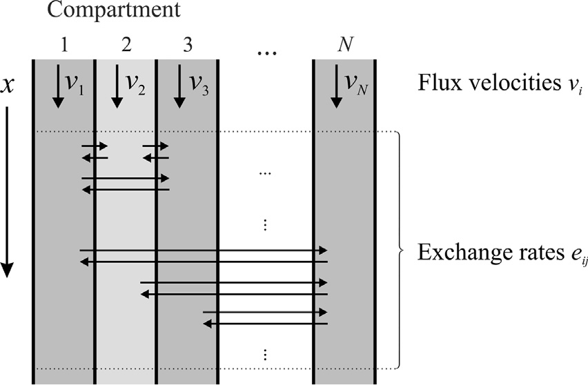
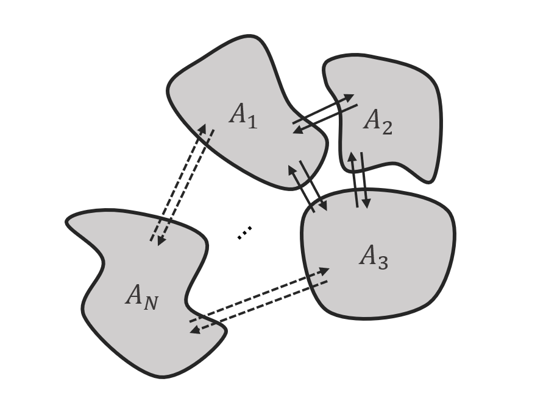

.. _multi_channel_transport_model_model:

Multichannel Transport model (MCT model) 
~~~~~~~~~~~~~~~~~~~~~~~~~~~~~~~~~~~~~~~~~

The Multichannel Transport (MCT) model in CADET is based on a class of compartment models introduced by Jonas Bühler et al. :cite:`Buehler2014`, which was originally developed in the field of plant sciences.
There it is used to determine transport and storage parameters of radioactive labelled tracer molecules from positron emission tomography (PET) or magnetic resonance imaging (MRI) based experimental data.
The model represents main functions of vascular transport pathways: axial transport of the tracer, diffusion in axial direction, lateral exchange between compartments and storage of tracer in compartments. Here, the axial direction represents the length of the stem of the plant and the lateral dimension its cross section. In the MCT context, the compartments of the model class are also referred to as channels.

The same model equations arise in describing other biological and technical processes outside of the field of plant sciences, where solutes are transported and exchanged between spatially separated compartments, for example liquid-liquid chromatography (LLC). Here, components in a mixture are separated based on their interactions with two immiscible phases of a biphasic solvent system :cite:`Morley2020`. The MCT model represents these phases by channels with respective transport and exchange properties. While the current implementation only covers linear driving forces for the exchange processes, the reaction module in CADET allows to add non-linear driving forces for the exchange processes and other chemical reactions in the channels. 

The MCT model equations are given for all channels :math:`l \in \{1, \dots, N_k\}` and components :math:`i \in \{1, \dots, N_c\}` by

.. math::

    \begin{aligned}
    \frac{\partial c_{i,l}^\ell}{\partial t}
    =
    - u_l \frac{\partial c_{i,l}^\ell}{\partial z}
    + D_{\text{ax},i,l} \frac{\partial^2 c_{i,l}^\ell}{\partial z^2}
    + \sum_{k=1}^{N_k} e^i_{kl} c_{i,k}^\ell A_k / A_l - e^i_{lk} c_{i,l}^\ell
    + f_{\text{react},i,l}\left( c^\ell_l \right),
    \end{aligned}

where :math:`e^i_{lk}` denotes the exchange rate of component :math:`i` from channel :math:`l` to channel :math:`k`, and :math:`A_l` denotes the cross section area of channel :math:`l`.
The equations are complemented by Danckwerts boundary conditions :cite:`Danckwerts1953`

.. math::

    \begin{aligned}
        u_l c^\ell_{\text{in},i,l}(t) &= u_l c^\ell_{i,l}(t,0) - D_{\text{ax},i,l} \frac{\partial c^\ell_{i,l}}{\partial z}(t, 0) & \forall t > 0,\\
        \frac{\partial c^\ell_{i,l}}{\partial z}(t, L) &= 0 & \forall t > 0.
    \end{aligned}

The MCT model describes :math:`N_k` one-dimensional spatially parallel channels (see :numref:`fig-model-class`).
In each channel :math:`l`, molecules of different species :math:`i`, represented by a liquid phase concentration :math:`c^\ell_{i,l}`, can be transported with flux velocities :math:`v_{i,l}` while undergoing axial diffusion: :math:`D_{\text{ax},i,l}`.
Molecules can be laterally exchanged between any pair of channels :math:`l` and :math:`k` with rate constant :math:`e^i_{lk}`.
If reactions are considered, the term :math:`f_{\text{react},i,l}\left(c^\ell_l\right)` represents the net change of concentration :math:`c^\ell_{il}` due to reactions in channel :math:`l` involving component :math:`i`.

.. _fig-model-class:

    Illustration of the Multichannel Transport model class and relevant parameters. 
    Figure taken from Jonas Bühler et al. :cite:`Buehler2014`.

The cross-section area :math:`A_N` is individually specified for each channel (see :numref:`fig-variable-areas`). The MCT is agnostic to the shape of these cross sections, while their ratio determines the distribution of the volumetric flow.

.. _fig-variable-areas:

    Scheme of exemplary channels with different cross section areas and arbitrary exchange between channels.

Use-case: Tracer transport in plants
^^^^^^^^^^^^^^^^^^^^^^^^^^^^^^^^^^^^

The MCT can be used to model tracer transport in plants, following Jonas Bühler et al. :cite:`Buehler2014`.
There, the model class is defined by a system of partial differential equations:

.. math::

	\frac{\partial \boldsymbol{\rho}(x,t)}{\partial t} = \left({A}^T-{V}\frac{\partial}{\partial x}+{D}\frac{\partial^2}{\partial x^2} \right){\boldsymbol{\rho}(x,t)}

- :math:`\boldsymbol{\rho}=({\rho}_1 \dots {\rho}_N)^T` is the tracer density within each channel :math:`N` at position :math:`x` and time :math:`t`.
- The coupling matrix :math:`A` contains exchange rates :math:`e_{lk}` describing the lateral tracer transport from channel :math:`l` to channel :math:`k`. All diagonal elements :math:`e_{ll}` in the first term are zero indicating there is no tracer exchange of one channel with itself. The second term ensures mass conservation and removes exchanged tracer from each channel respectively, by subtracting the sum of all exchange rates of a row (and therefore channel) from the diagonal. The third term describes the decay of a radioactive tracer at a tracer specific rate :math:`\lambda`.

.. math::

    A=\begin{bmatrix}
    0 & e_{12} & \dots & e_{1N} \\
    e_{21} & \ddots & & \vdots\\
    \vdots & & \ddots & e_{(N-1)N}\\
    e_{N1} & \dots & e_{N(N-1)} & 0
    \end{bmatrix}-   
    \begin{bmatrix}
    {\sum_{k=1}^{N} e_{1k}} &  & 0 \\
     & \ddots & \\
     0 &  & {\sum_{k=1}^{N} e_{Nk}}
    \end{bmatrix}-
    \lambda {I}

- The diagonal matrix :math:`V` contains the flux velocities :math:`v_{l}` for each channel.

.. math::

    V=\begin{bmatrix}
    v_1 &  & 0 \\
     & \ddots & \\
     0 &  & v_N
    \end{bmatrix}

- The diagolal matrix :math:`D` contains the dispersion coefficients :math:`d_{l}` for each channel.

.. math::

    D=\begin{bmatrix}
    d_1 &  & 0 \\
     & \ddots & \\
     0 &  & d_N
    \end{bmatrix}

All parameters can be zero to exclude the respective mechanism from the model.
A chart of all resulting valid models of the model family can be found in Bühler et al. :cite:`Buehler2014`.

For information on model parameters see :ref:`multi_channel_transport_model_config`.