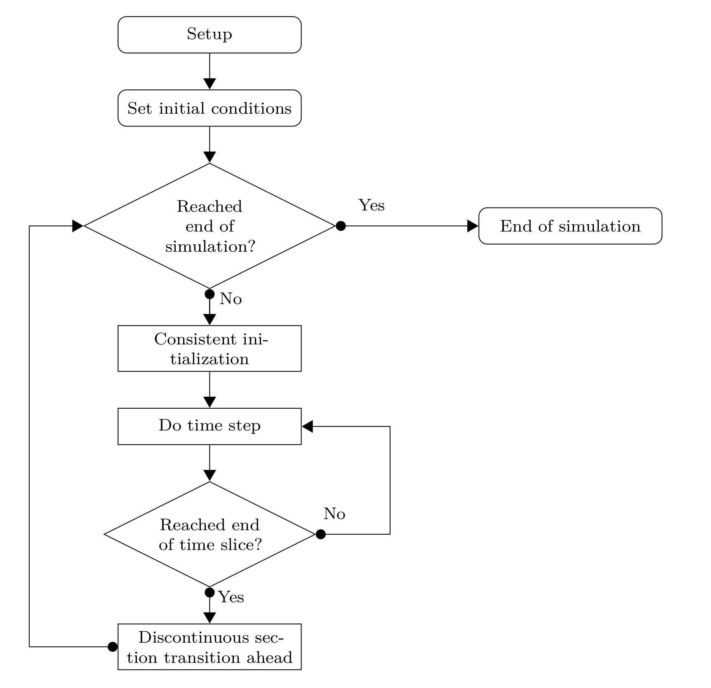
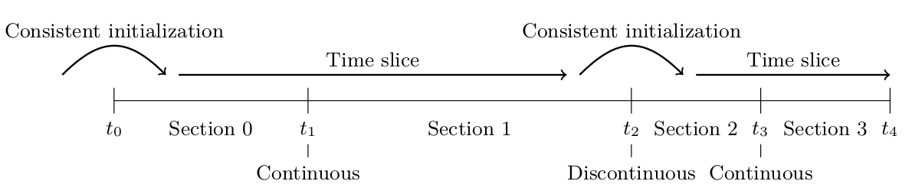

.. _simulation:

Simulation
==========

This chapter gives an overview of the simulation process and the different steps involved.

CADET uses a backward-differentiation-formula (BDF) time discretization as implemented by the IDAS solver from SUNDIALS :cite:`Hindmarsh2005`.
Each time step requires the solution of a nonlinear algebraic system of equations is performed by a Newton method. 
Since chromatographic systems can exhibit strong nonlinearity and stiff systems, the Jacobian of the equation system is always updated (i.e., an “exact” Newton method is used).

.. _SimFlowchart:

	General time integration procedure

The general control flow of a simulation is shown in :numref:`SimFlowchart`.
Some aspects of the tasks involved are discussed below.

.. _SimTimeSectionsTransitions:

Time sections and transitions
-----------------------------

The timespan :math:`\left[t_0, t_{\text{end}}\right]` of the simulation can be divided into multiple time sections :math:`\left[t_i, t_{i+1}\right]` with

.. math::

    \begin{aligned}
   	    t_0 < t_1 < \dots < t_i < t_{i+1} < \dots < t_{\text{end}}.
    \end{aligned}

Time sections are used for various purposes, for example, for defining piecewise polynomials used as inlet profiles or external function, for changing operating conditions such as flow rates, or for changing the connectivity in a network of unit operations.
A sequence of (one or more) time sections with smooth transitions is called a time slice (see :numref:`SimTimeSections`).

A transition from one section to the next can either be smooth or discontinuous.
On smooth transitions, the time integrator can just step over the section transition.
Contrary to smooth transitions, a discontinuous transition requires some extra work in resetting the time integrator and finding consistent initial conditions for the next time slice.

.. _SimTimeSections:

	Time sections, time slices, and transitions between them

.. _SimTimeSectionsSpecification:

Time section specification
~~~~~~~~~~~~~~~~~~~~~~~~~~

Time sections are specified by an array (``SECTION_TIMES``, see Tab. :ref:`FFSolverSections`) which contains the :math:`t_i` that denote the start- and endpoint of a time section :math:`\left[t_i, t_{i+1}\right]`.
This means, that the array contains :math:`n+1` values if there are :math:`n` sections.
The smoothness of a section transition is indicated by the array ``SECTION_CONTINUITY``, which contains :math:`n-1` elements if there are :math:`n` sections.

.. _SimSetup:

Setup
-----

In the setup phase, the model specification is checked and data structures are prepared for the simulation.
The simulation can be run multiple times with different initial conditions, which also allows to continue a simulation.
However, the model structure must not change after this point.
This means, the different model and submodel types (e.g., unit operation model, binding model) as well as their discretization (i.e., number of cells) and structure (i.e., number of components, number of reactions) are fixed. On the contrary, their parameters (e.g., flow rates, porosities, dispersion coefficients) may change on different runs of a prepared simulation.

This assumption allows an accelerated simulation as there is no memory allocation performed during time integration.

.. _SimConsistentInit:

Consistent initialization
-------------------------

At the beginning of the simulation and on discontinuous section transitions, consistent initial conditions have to be computed.
In CADET, the general differential-algebraic equation (DAE)

.. math::

    \begin{aligned}
   	    F(t, y, \dot{y}, p) = 0
    \end{aligned}

consists of purely algebraic equations that do not contain :math:`\dot{y}` and dynamic equations.
Let :math:`\mathcal{I}_d` be the index set of dynamic equations and :math:`\mathcal{I}_a` the index set of algebraic equations.
The general DAE can be decomposed into

.. math::

    \begin{aligned}
   	    M \dot{y}_{\mathcal{I}_d} + G_{\mathcal{I}_d}(t, y, p) &= 0, \\
   	    G_{\mathcal{I}_a}(t, y, p) &= 0,
    \end{aligned}

where :math:`M` is the so called “mass matrix”, which essentially consist of the state time derivative Jacobian :math:`\partial F / \partial \dot{y}`.
Furthermore, it is assumed that the Jacobian of the algebraic equations with respect to the algebraic variables :math:`\partial G_{\mathcal{I}_a} / \partial y_{\mathcal{I}_a}` is invertible.
Hence, the original DAE is of differential index 1.

Given :math:`y_{\mathcal{I}_d}`, consistently initialization means finding :math:`y_{\mathcal{I}_a}`, :math:`y_{\mathcal{I}_d}`, and :math:`\dot{y}` such that the DAE holds at the initial time point :math:`t_0` and can be solved for some non-empty time span.
Thus, consistent initial conditions :math:`y_0` and :math:`\dot{y}_0` satisfy

.. math::

    \begin{aligned}
   	    0 &= M \dot{y}_{\mathcal{I}_d} + G_{\mathcal{I}_d}\left(t_0, y, p\right), \\
   	    0 &= G_{\mathcal{I}_a}\left(t_0, y, p\right), \\
   	    0 &= \frac{\partial G_{\mathcal{I}_a}}{\partial t}\left(t_0, y, p\right) + \frac{\partial G_{\mathcal{I}_a}}{\partial y}\left(t_0, \dot{y}, p\right).
    \end{aligned}

The last equation, which determines :math:`\dot{y}_{\mathcal{I}_a}`, arises from taking the total derivative with respect to time :math:`t` of the second equation.

Concluding, a nonlinear algebraic equation system has to be solved in order to compute consistent initial conditions.
The error in the solution of these systems is controlled by the ``ALGTOL`` setting (see Tab. :ref:`FFSolverTime`).

.. _SimTimeIntegration:

Time stepping
-------------

Given the general differential-algebraic equation

.. math::

    \begin{aligned}
   	    F(t, y, \dot{y}, p) = 0, \qquad y\left(t_0 \right) = y_0, \qquad \dot{y}\left(t_0 \right) = \dot{y}_0
    \end{aligned}

with consistent initial values :math:`y_0` and :math:`\dot{y}_0`, the BDF discretization uses past time steps :math:`y\left( t_{\tau - i} \right)` to compute the current :math:`\dot{y}\left(t_\tau\right)` as

.. math::

    \begin{aligned}
        \dot{y}\left(t_\tau\right) = \frac{1}{\Delta t_\tau} \sum_{i=0}^{q_{\tau}} \alpha_{\tau,i} y\left(t_{\tau-i}\right),
    \end{aligned}

where :math:`t_\tau` denotes some time step.
The IDAS time integrator adaptively changes the step size :math:`{\Delta t_\tau = t_\tau-t_{\tau-1}}` and order :math:`1 \le q_{\tau} \le 5` in each time step and automatically determines the corresponding coefficients :math:`\alpha_{\tau,i}`.
This *ansatz* is inserted into the DAE and the resulting nonlinear algebraic equation system is solved for :math:`y_{\tau} = y\left( t_\tau \right)` using a Newton method.

.. math::
    :label: BDFNonlinSystem

    \begin{aligned}
        H(y_\tau) = F\left(t_\tau,y_\tau,\frac{1}{\Delta t_\tau} \,\sum_{i=0}^{q_\tau}{\alpha_{\tau,i} \, y_{\tau-i}}, p\right) = 0 
    \end{aligned}

This requires (possibly many) solutions of linear equation systems involving the Jacobian of :math:`H` given by

.. math::

    \begin{aligned}
        \frac{\mathrm{d}H}{\mathrm{d}y_\tau} = \frac{\partial F}{\partial y} + \frac{\alpha_{\tau,0}}{\Delta t_\tau} \frac{\partial F}{\partial \dot{y}}.
    \end{aligned}

The Jacobian of :math:`H`, which is the linear combination of the partial derivatives :math:`\partial F / \partial y` and :math:`\partial F / \partial \dot{y}`, can be calculated in two ways.
The fastest way is the analytic computation, which is to be preferred if available.
However, the implementation of the analytic Jacobian can be time consuming and complicated, especially when quickly testing new models.
As a remedy, CADET offers to compute the complicated Jacobian :math:`\partial F / \partial y` automatically by automatic differentiation (AD).
The much simpler Jacobian :math:`\partial F / \partial \dot{y}` has to be implemented manually.

.. _SimTimeIntegrationAdaptivity:

Adaptivity
~~~~~~~~~~

The BDF order :math:`q_{\tau}` and size of the time step :math:`t_\tau` are chosen such that the error bounds are satisfied with minimal work.
Equation :eq:`BDFNonlinSystem` is solved with a Newton iteration using very few iterations (``MAX_NEWTON_ITER`` from Table :ref:`FFSolverTime`) since the starting point is assumed to be close to the solution as the time steps are small.
If the solution of the Newton iteration does not pass the *convergence test*, the step size :math:`t_\tau` is reduced and the Newton iteration is tried again.
This may happen at most ``MAX_CONVTEST_FAIL`` times, otherwise time integration is aborted with failure.
Having a solution of the Newton iteration at hand, a *local truncation error test* is performed which controls the error of the BDF method.
If this test fails, step size :math:`t_\tau` and order :math:`q_{\tau}` are adapted and the process restarts with solving the nonlinear system Eq. :eq:`BDFNonlinSystem`.
The error test may be failed at most ``MAX_ERRTEST_FAIL`` times before time integration is aborted with failure.

Error bounds for the local truncation error test are specified by an absolute tolerance (``ABSTOL``) and a relative tolerance (``RELTOL``).
Note that the relative tolerance only works for non-zero values, whereas zero values are accounted for by the absolute tolerance.
For example, a relative tolerance of :math:`10^{-4}` and absolute tolerance of :math:`10^{-8}` requests :math:`3` significant digits (correct digits after the comma in scientific notation) and considers all numbers with magnitude smaller than :math:`10^{-8}` as :math:`0`.

The size of the first time step in a time slice is given by ``INIT_STEP_SIZE`` from Table :ref:`FFSolverTime`.
If a simulation fails on the first time step, it might help to reduce the initial step size.
It can also help to increase the error tolerances, at the cost of imprecise results over the whole course of the simulation.

It can happen that due to severe stiffness or ill-posed models a simulation may exceed its computational budget given by the maximum number of time steps (per time slice) ``MAX_STEPS``.
In this case, the formulation of the model should be checked and, if necessary, the error tolerances increased.
Note that the number of time steps is independent of possible ``USER_SOLUTION_TIMES`` and refers to internal steps of the time integrator.

On the other extreme, the time integrator might jump over an important change in the solution or not capture some feature of the solution because of too large time steps.
This can be avoided by specifying the maximum time step size ``MAX_STEP_SIZE``.
However, such a situation is unlikely to occur and can also be alleviated by placing a discontinuous section transition at the time of the event.

Note that while the error in time integration is controlled and can (in theory) be made arbitrarily small, the spatial discretization error is not.
Hence, it is important and necessary to test different spatial resolutions (number of cells) in order to find a sufficiently accurate (but minimal) number of grid cells.
This is particularly relevant for problems with steep fronts as a low spatial resolution adds a substantial amount of numerical dispersion to the solution.

.. _SimParamSens:

Parameter sensitivities
-----------------------

Parameter sensitivities :math:`s = \partial y / \partial p` of a solution :math:`y` to the DAE with respect to some parameter :math:`p` are required for various tasks, for example, parameter estimation, process design, and process analysis.
The CADET simulator implements the forward sensitivity approach which creates a linear companion DAE for each sensitive parameter

.. math::

    \begin{aligned}
        0 &= \frac{\mathrm{d}}{\mathrm{d}p} F(t, y, \dot{y}, p) = \frac{\partial F}{\partial y}(t, y, \dot{y}, p) \frac{\partial y}{\partial p} + \frac{\partial F}{\partial \dot{y}}(t, y, \dot{y}, p) \frac{\partial \dot{y}}{\partial p} + \frac{\partial F}{\partial p}(t, y, \dot{y}, p) \\
        &= \frac{\partial F}{\partial y}(t, y, \dot{y}, p) s + \frac{\partial F}{\partial \dot{y}}(t, y, \dot{y}, p) \dot{s} + \frac{\partial F}{\partial p}(t, y, \dot{y}, p).
    \end{aligned}

These linear DAEs depend on the solution :math:`y`, :math:`\dot{y}` of the original DAE system.
Consequently, the sensitivity systems are solved together with the original DAE system in a staggered approach :cite:`Feehery1997`.

After the nonlinear Eq. :eq:`BDFNonlinSystem` has been successfully solved using Newton iteration (i.e., it has passed the convergence test), each sensitivity is solved using the same Newton iteration.
If direct linear solvers were used, this iteration would convergence with a single iteration as there is no nonlinearity.
The Newton method for the sensitivities performs at most ``MAX_NEWTON_ITER_SENS`` (see Table :ref:`FFSolverTime`) iterations.
Assuming the convergence test has passed for each sensitivity, the local truncation error test is performed for the full set of variables (i.e., original system and sensitivities).
The sensitivities can be excluded from the local truncation error test by setting ``ERRORTEST_SENS`` appropriately.
Note that time integration step size is always affected by sensitivities due to possible convergence test failures.

While the Jacobians :math:`\partial F / \partial y` and :math:`\partial F / \partial \dot{y}` can be computed either analytically or via AD, the last term :math:`\partial F / \partial p` is always computed by AD.
In fact, the terms :math:`\partial F / \partial y` and :math:`\partial F / \partial p` can be computed by one AD-enabled evaluation of :math:`F` using the vector mode with appropriate seed vectors :cite:`Puttmann2016`.

A parameter sensitivity is specified by identifying the involved parameters, which can be more than one (see below).
Parameters are identified by name and multiple indices, which may not all be used (see Tab. :ref:`FFSensitivityParam`). Indices that are not used for identification (e.g., flow rate is independent of bound phase or component) are set to :math:`-1`. All other indices are zero-based.

Note that the sensitivity systems need to be consistently initialized, too.
However, since only linear systems are involved, no nonlinear equation system has to be solved and the procedure is much simpler computationally.

.. _SimParamSensJointParams:

Joint parameters
~~~~~~~~~~~~~~~~

The use of AD also enables support of meta parameters or joint parameters.
Consider the situation in which several parameters :math:`p_1, p_2, \dots, p_n` depend (linearly) on a single meta parameter :math:`p`

.. math::

    \begin{aligned}
        p_i = p_i(p) = \alpha_i p \qquad \text{ for } i = 1, \dots, n
    \end{aligned}

and some coefficients :math:`\alpha_i \in \mathbb{R}`.
Hence, the DAE residual function :math:`F` becomes

.. math::

    \begin{aligned}
        F(t, y, \dot{y}, p_1(p), \dots, p_n(p)) = 0
    \end{aligned}

and the partial derivative :math:`\partial F / \partial p` can be computed automatically by AD:

.. math::

    \begin{aligned}
        \frac{\partial F}{\partial p} = \frac{\partial F}{\partial p_1} \alpha_1 + \dots + \frac{\partial F}{\partial p_n} \alpha_n.
    \end{aligned}

In order to use this functionality, all parameters involved have to be specified in a single sensitivity instance (``param_XXX`` group, see Tables :ref:`FFSensitivity` and `FFSensitivityParam`) by using arrays for the name and indices instead of scalar values.
The coefficients :math:`\alpha_i` are provided in the ``SENS_FACTOR`` vector.

A simple example for a situation, which benefits from having a single meta parameter, would be a chain of unit operations in a network in which the sensitivity with respect to the flow rate is to be computed.
Instead of computing the sensitivity with respect to each single flow rate and fusing them together in a postprocessing step, a meta parameter that maps to all flow rates can be introduced.

Note that nonlinear relationships between original parameter and meta parameters are supported by updating the coefficients :math:`\alpha_i` before each simulation:

.. math::

    \begin{aligned}
        \alpha_i = \frac{\partial p_i}{\partial p}.
    \end{aligned}

