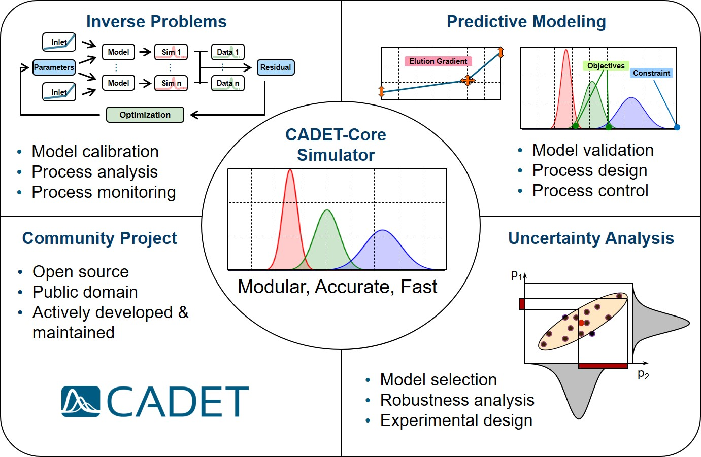

# Summary

Biotechnology process modeling integrates detailed scientific insight into mass transfer phenomena and phase transitions with the practical demands of industrial process design and optimization. [CADET-Core](https://github.com/cadet/CADET-Core) is an open-source software platform offering powerful tools for comprehensive modeling and simulation of biotechnology processes, powered by state-of-the-art numerical algorithms. Originally developed in 2004 at Forschungszentrum Jülich for chromatography simulation [@vonLieres:2010], CADET-Core has since evolved into a versatile tool serving a wide range of biotechnology applications.

CADET-Core supports unit operations such as chromatography, filtration, and crystallization, along with auxiliary components such as hold tanks, tubes, valves, and detectors. These elements can be interconnected to form complex networks, supporting closed-loop feedback and flexible structures. The modular design and computational efficiency of CADET-Core enable simulation and advanced optimization of such processes.

# Statement of Need

The development and optimization of modern biotechnology processes are increasingly driven by in silico methods. Mechanistic modeling and simulation are important tools in this field, yet they face substantial challenges. One key challenge is selecting models that satisfy practical requirements and constraints, necessitating software that supports both a broad variety of models and their combinatorial complexity for process design. The implementation of state-of-the-art numerical methods and their advancement is equally important: Computational efficiency and numerical stability are essential to provide accurate approximations to the exact solutions, which in most practical cases cannot be derived analytically. These numerical aspects are particularly relevant as models become more complex in capturing intricate phenomena and since estimation and optimization algorithms for solving inverse problems require numerous forward simulations.

CADET-Core addresses these challenges with a high-performance C++ solver for domain-specific partial differential-algebraic equations that supports an extensive range of established [biotechnology process models](https://cadet.github.io/master/modelling/).
This includes a hierarchical family of transport models, which can be combined with various adsorption and reaction models to describe physicochemical processes in biotechnological unit operations. CADET-Core supports strongly coupled networks of these unit operations, including cyclic systems. Its modular design provides flexibility in customizing and connecting models to meet specific user requirements while automatically assembling the spatially discretized governing and constitutive equations in a numerically efficient manner.

The latest major release, version 5.0, introduces several key advancements. Numerical improvements substantially enhance computational performance, particularly through the development and implementation of a spatial discontinuous Galerkin discretization method [@Breuer:2023].
Further, a modular family of crystallization models is implemented that are solved with specifically designed size-based finite volume (FV) methods [@Zhang1:2024], ensuring compatibility across all unit operations.
Moreover, the existing axial transport models are extended to support radial transport in cylindrical confinements and parallel transport in multiple channels [@Lanzrath:2024].

As a feature-complete tool, CADET-Core offers a comprehensive platform for modeling and simulating biotechnology processes, while ongoing active development targets emerging needs in a rapidly evolving field. Continuous integration, automated testing, and delivery pipelines ensure the reliability and robustness of CADET-Core. Computation results are documented with comprehensive metadata, including model configurations and commit hashes, to maintain full reproducibility and compliance with FAIR standards.

CADET-Core is the central module within the broader [CADET](https://github.com/cadet) software framework (\autoref{fig:CADET-Core}). It seamlessly integrates with other modules, such as [CADET-Process](https://github.com/cadet/CADET-Process), which provides a Python interface for model configuration and supports computational engineering tasks such as model calibration and process optimization. [CADET-Verification](https://github.com/cadet/CADET-Verification) enables rigorous testing based on order analysis and arbitrary precision reference solutions supplied by [CADET-Semi-analytic](https://github.com/cadet/CADET-Semi-analytic). [CADET-RDM](https://github.com/cadet/CADET-RDM) introduces an electronic lab notebook specifically tailored to manage research data in digital twin applications. Finally, the CADET framework defines unified interface specifications to enable interoperability of different front-end software (e.g., CADET-Process, [CADET-Python](https://github.com/cadet/CADET-Python)), back-end solvers (e.g., CADET-Core, [CADET-Julia](https://github.com/cadet/CADET-Julia)) and custom tools, aiming at establishing community standards.

\

 

CADET-Core is readily accessible through the [Conda-Forge package manager](https://anaconda.org/conda-forge/cadet). The CADET team is committed to sustainable research software engineering practices and encourages external contributions to further expand the platform. Through reliable, high-quality software and an ever-growing [community](https://forum.cadet-web.de/), CADET has become a widely adopted tool, driving research and innovation in both academia and industry.

# Use Examples

To date, CADET has been mentioned in more than 250 articles as highlighted in the [Helmholtz Software Directory](https://helmholtz.software/software/cadet). These studies demonstrate the relevance of CADET-Core as a versatile tool for biotechnology process modeling and optimization across a wide range of applications. Most recent examples include:

@LeBarre:2024 used CADET-Core to optimize a mixed-mode size-exclusion chromatography method for polishing human antibodies in flow-through mode. By improving mass transfer and interaction effects within the chromatography column, antibody purification could be enhanced.

@LorenzCristea:2024 utilized CADET-Core to estimate adsorption parameters for colloidal particle interactions in chromatography. This application involved the development and validation of adsorption models to improve parameter estimation techniques for colloidal behavior.

@Altern:2024 incorporated CADET-Core into a high-throughput in silico workflow to optimize multimodal chromatography in monoclonal antibody purification. This enabled rapid simulation of chromatographic conditions to support process optimization and accelerate development cycles for large-scale bioprocessing.

# Community and Contributions

CADET-Core is an open-source project that welcomes community contributions. Participation is encouraged through issue submission or pull requests via the [GitHub repository](https://github.com/cadet/CADET-Core). A [developer guide](https://cadet.github.io/master/developer_guide/index.html) provides direction for contributors, and the [CADET forum](https://forum.cadet-web.de/) offers active support for both users and developers. To foster a welcoming and supportive environment, the project follows the [contributor covenant](https://www.contributor-covenant.org/) code of conduct. 

# License and Citation

CADET-Core is distributed under the [GPL 3.0 license](https://www.gnu.org/licenses/gpl-3.0.en.html). 
For publications, CADET-Core should be cited following the [citation recommendations](https://github.com/cadet/CADET-Core/blob/master/README.rst).

# Acknowledgements

We gratefully acknowledge Joel Andersson, Andreas Püttmann and Sebastian Schnittert for substantial contributions to earlier versions of CADET-Core.

# References
